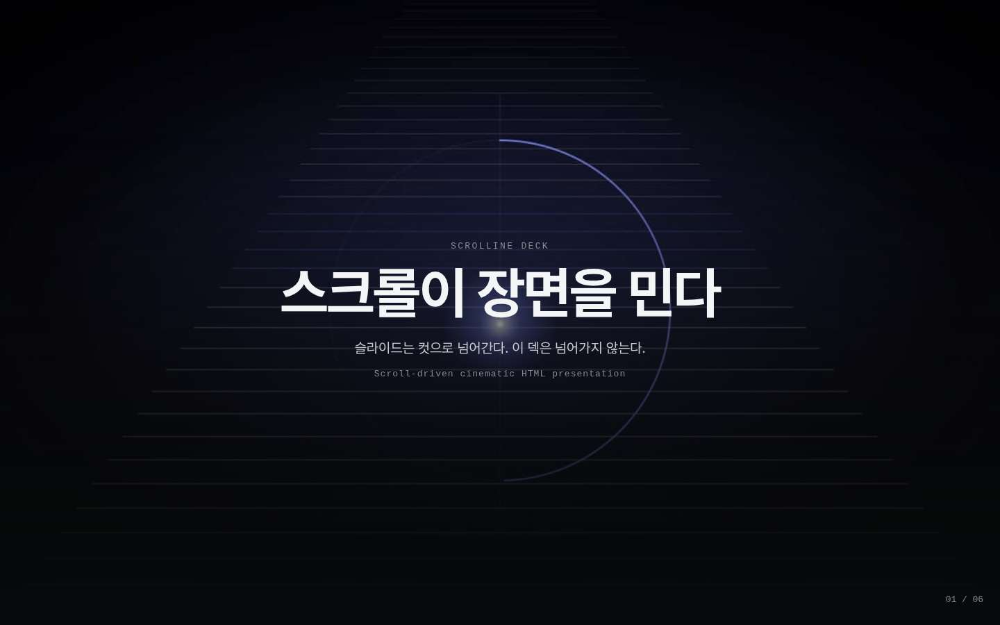
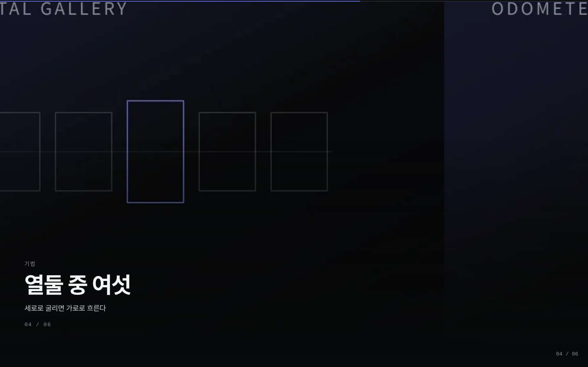
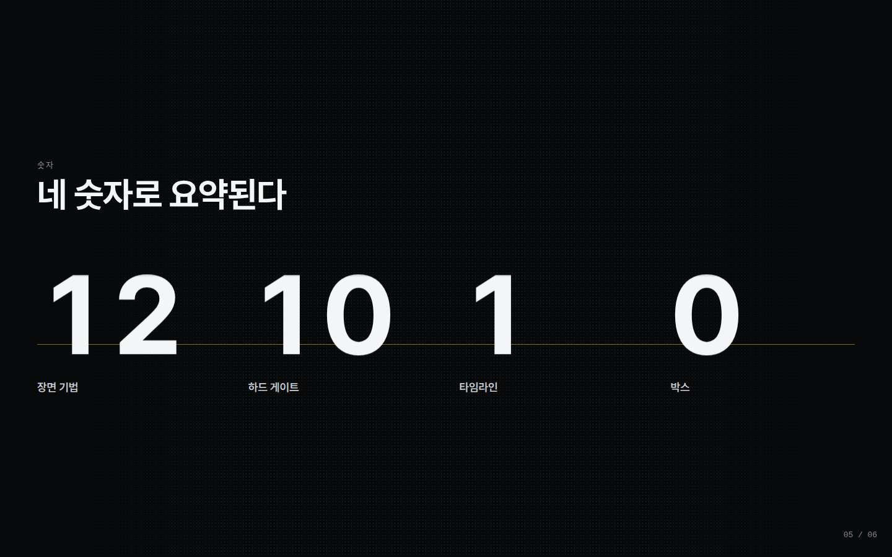
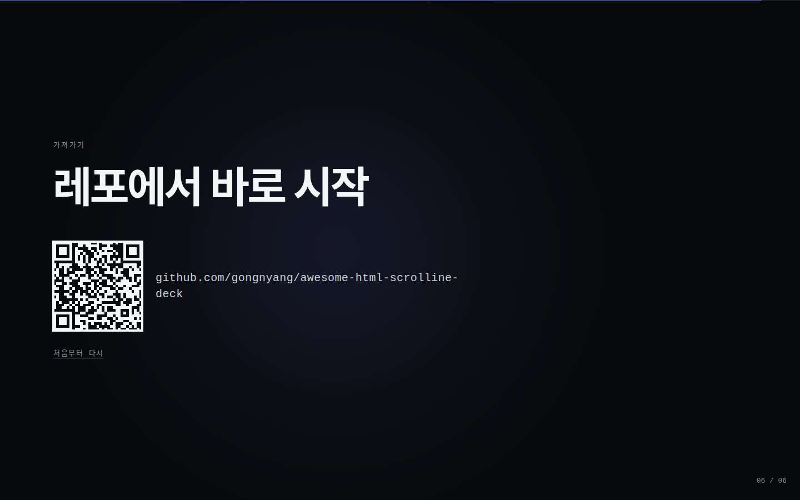

<div align="center">

# Scrolline Deck

**스크롤로 굴리는 시네마 HTML 발표자료 — 스크롤텔링 덱.**

휠 한 칸은 다음 슬라이드가 아니다. 지금 서 있는 장면의 다음 프레임이다.

[](https://github.com/gongnyang/awesome-html-scrolline-deck/actions/workflows/ci.yml)
[](LICENSE)


[English README](README.md) · [스킬 라우터](SKILL.md) · [샘플 덱](examples/sample-deck/)

</div>

<table>
<tr>
<td width="50%"></td>
<td width="50%"></td>
</tr>
<tr>
<td width="50%"></td>
<td width="50%"></td>
</tr>
</table>

<sub>위 이미지는 전부 `verify`가 실제 휠 이벤트로 샘플 덱을 굴려 찍은 캡처다. 목업이 아니다.</sub>

---

## 무엇인가

슬라이드 덱은 컷으로 넘어간다. **스크롤텔링 덱**은 넘어가지 않는다. 장면이 화면에 고정된 채로 휠이 그 장면의 진행률을 0에서 1까지 밀기 때문에, 움직임이 끊기지 않고 속도는 발표자의 손에 남는다. Scrolline Deck은 이것을 세 가지로 제공한다.

- **Claude Code 스킬**(`SKILL.md`) — 주제와 개요를 주면 덱을 대신 집필한다.
- **CLI**(`scripts/cli.mjs`) — Vite 프로젝트를 만들고, 12종 템플릿에서 장면을 얹고, 영상을 프레임으로 자르고, 게이트를 돌린다.
- **엔진**(`engine/`) — GSAP ScrollTrigger + Lenis. 생성된 프로젝트 안으로 복사되므로 이 도구를 더 안 써도 덱은 계속 돈다.

여기에 **게이트 10종**(G1–G10, 여기에 스키마 검사 S0)이 붙는다. 전부 exit-code로 막고, 그중 여섯은 실제 브라우저에서 실제 휠 이벤트로 굴려 확인한다.

산출물은 로컬에서 그대로 도는 정적 HTML 번들이다. 배포는 의도적으로 범위 밖이다.

## 설치

```bash
git clone https://github.com/gongnyang/awesome-html-scrolline-deck.git
cd awesome-html-scrolline-deck
npm install
```

Claude Code 스킬로 쓰려면 스킬 폴더에 심링크를 건다.

```bash
ln -s "$(pwd)" ~/.claude/skills/scrolline-deck
```

이후 "○○ 주제로 스크롤텔링 덱 만들어"라고 하면 Claude가 `SKILL.md`를 따라 진행한다.

**요구 사항.** Node ≥ 20. 하드 의존은 `qrcode` 하나다. Playwright는 선택이고, 없으면 브라우저 게이트가 `skipped`로 빠지며 exit 0으로 끝난다. `ffmpeg`은 `scrolline frames`에서만 필요하다.

## 퀵스타트

```bash
# 1. 스캐폴드
node scripts/cli.mjs init my-deck --title "우리는 이렇게 출시한다" --style dark

# 2. 장면 추가 (스토리보드 한 행에 한 번, 같은 기법 연속 배치 금지)
node scripts/cli.mjs add frame-scrub-hero    --id 01-hero    --kicker "2026"  --title "우리는 이렇게 출시한다"
node scripts/cli.mjs add horizontal-gallery  --id 02-work    --kicker "작업"  --title "올해 내보낸 여섯 가지"
node scripts/cli.mjs add closing-qr          --id 03-closing --kicker "다음"  --title "같이 만들어요" --url https://example.com

# 3. 띄우기
cd my-deck && npm install && npm run dev

# 4. 게이트
node ../scripts/cli.mjs check .
node ../scripts/cli.mjs verify .     # qa/<id>-{30,55,85}.jpg 생성
```

장면마다 캡처 세 장을 직접 읽는다. 30%는 진입 중, 55%는 말을 얹을 완성 프레임, 85%는 퇴장 중이어야 한다. 55% 화면 앞에 서 있기 싫다면 잘못된 건 캡처가 아니라 안무다.

## 12기법

| technique | 무엇을 하나 | 언제 쓰나 | 에셋 | 기본 `pinVh` |
|---|---|---|---|---|
| `frame-scrub-hero` | 제목이 선 채로 뒤에서 프레임 시퀀스가 스크럽된다 | 이미지로 말문을 열 때 | frames + poster | 260 |
| `word-relay` | 화살표로 나눈 제목이 단어마다 바통을 넘긴다 | 한 문장으로 말문을 열 때 | 없음 | 220 |
| `kinetic-titles` | 번호 붙은 제목이 대각선 위로 조립된다 | 세션의 얼개를 보일 때 | 없음 | 240 |
| `horizontal-gallery` | 세로 스크롤이 가로 레일을 민다 | 이미지를 여러 장 보일 때 | 이미지 3–10 | 320 |
| `anatomy-rows` | 한 덩어리가 주석 달린 행으로 갈라진다 | 하나를 뜯어 보일 때 | 이미지 1 | 300 |
| `frame-scrub-video` | 본문용 프레임 스크럽 | 움직이는 과정을 보일 때 | frames + poster | 280 |
| `parallax-video` | 핀 없이 지나가는 영상 패럴랙스 | 객석에 숨을 줄 때 (`pin: false`) | video + poster | 130 |
| `paper-assembly` | 낱장이 모여 한 덩어리가 된다 | 쌓인 작업량을 보일 때 | 이미지 3–8 | 260 |
| `odometer-stats` | 숫자가 릴 위에서 굴러 도착한다 | 수치를 못 박을 때 | 없음 | 220 |
| `wipe-transform` | 한 면이 다음 면으로 와이프된다 | A가 B로 바뀌는 걸 보일 때 | 이미지 2–5, video 선택 | 300 |
| `tilt-card` | 인물 한 장을 느린 기울기로 세운다 | 사람을 소개할 때 | 이미지 1 | 200 |
| `closing-qr` | QR·주소·첫 장면으로 돌아가는 길 | 링크를 손에 쥐여 줄 때 | qr.svg | 200 |

정본은 `references/techniques.md`이고, 위 표는 그 값을 따라간다.

## `deck.json`

덱 전체가 데이터 파일 하나다. 움직임은 장면 폴더가, 의미는 이 파일이 갖는다.

```jsonc
{
  "title": "Scrolline Deck",
  "lang": "ko",
  "presenter": { "name": "공냥이", "autoDurationSec": 180 },
  "theme": { "style": "dark", "accent": "#5e6ad2" },
  "scenes": [
    {
      "id": "01-hero",                    // src/scenes/<id>/ 폴더명과 반드시 같다
      "order": 1,
      "technique": "frame-scrub-hero",
      "pinVh": 260,                       // 핀 거리 = 뷰포트 높이의 %
      "pin": true,
      "assets": {
        "frames": "/frames/hero/f_%03d.jpg",
        "count": 120,
        "critical": [1, 30, 60, 90, 120], // 장면 시작 전에 먼저 디코드
        "poster": "/frames/hero/poster.jpg"
      },
      "copy": { "kicker": "2026", "title": "우리는 이렇게 출시한다", "lines": ["한 줄, 많아야 두 줄."] },
      "notes": "필수. 발표 중 N 패널에 뜬다.",
      "fallback": "모션 축소 시 포스터 정지 + 제목 페이드인."
    }
  ]
}
```

전체 스키마는 [`references/deck.schema.json`](references/deck.schema.json)에 있다.

## 게이트

`check`는 정적이라 브라우저가 필요 없다. `verify`는 Chromium을 실제 휠 이벤트로 굴린다. `scrollTo`는 쓰지 않는다 — 좌표로 순간이동해야만 도는 덱은 진짜 휠 앞에서 깨지기 때문이다.

| | 게이트 | 무엇을 막나 |
|---|---|---|
| **check** | G1 | 장면 모듈이 `{ id, mount, build, unmount }`를 내보내고 `id`가 폴더명과 같은가 |
| | G2 | 타임라인 합이 1.001 이하인가, `order`·`pinVh`가 정상인가 |
| | G3 | tween 문자열 안에 `var(`가 없는가 + 린트 L1(색상 하드코딩 0)·L2(선택자 전부 `[data-scene="<id>"]` 스코프)·L3(애니 path `pathLength="1"`) |
| | G4 | 장면과 검증 경로에 `window.scrollTo`·`scrollIntoView`가 없는가 |
| | S0 | `deck.json`이 스키마를 통과하고 에셋 경로가 디스크에 실재하는가 |
| **verify** | G5 | 실측 핀 거리 = 뷰포트 높이의 `pinVh%`, 오차 ±2px |
| | G6 | 장면 55% 지점 가시 요소 ≥ 3, 그리고 캡처 3장 기록 |
| | G7 | `→` 착지점이 다음 핀의 35% 지점에서 4px 이내, 그 화면 가시 요소 ≥ 3 |
| | G8 | 주행 전체에서 `console.error` 0, 페이지 에러 0 |
| | G9 | 1440px·390px에서 가로 넘침 0 |
| | G10 | 모션 축소 설정에서 핀 거리 0, 각 장면 가시 요소 ≥ 3 |

Playwright가 없으면 `verify`는 설치 방법을 알려주고 `skipped: true`로 보고한 뒤 exit 0으로 끝난다. CI가 우연히 초록이 되는 것보다 솔직한 쪽이다.

## 발표

| 키 | 동작 |
|---|---|
| `→` `Space` / `←` | 다음 / 이전 장면, 핀 35% 지점 착지 |
| `1`–`9`, `0` | 장면 1–9로 점프, `0`은 10번째 장면 |
| `P` | 자동 진행 토글(`presenter.autoDurationSec`), 아무 입력이나 들어오면 정지 |
| `F` | 전체화면 |
| `H` | 커서 숨김 |
| `N` | 발표자 노트 패널 |

`npm run build && npm run preview`로 빌드하고, **무대에 올라갈 그 PC에서 `verify`를 한 번** 돌린다.

## 폴더 구조

```
awesome-html-scrolline-deck/
├─ SKILL.md              Claude Code 라우터: 원칙·워크플로·기법 고르기
├─ engine/               생성된 덱마다 복사되는 런타임(Vite API 없음)
├─ templates/project/    Vite 스캐폴드: index.html, tokens.css, data/deck.json
├─ templates/scenes/     기법 템플릿 12종(scene.html/css/js + template.json)
├─ references/           계약·스키마·기법·안무·디자인·함정
├─ scripts/              cli.mjs + cmd/ + gates/ + lib/
├─ examples/sample-deck/ 이 README의 캡처가 나온 6장면 덱
├─ tests/                node --test: 게이트 단위·bad-* 픽스처·빌드 스모크
└─ book/                 동반 실용서(국문, PDF는 docs/)
```

## 기여

이슈와 PR 환영한다. 새 기법 하나를 추가하려면 `templates/scenes/<technique>/` 아래 네 파일(`scene.html`·`scene.css`·`scene.js`·`template.json`)과 `references/techniques.md` 한 행, 그리고 통과하는 `node --test`가 필요하다. 색은 토큰으로, 타임라인 합은 1 이하로, 박스는 넣지 않는다.

## 라이선스

MIT. [LICENSE](LICENSE) 참조.

## 만들어진 배경

패스트캠퍼스 **「ChatGPT Astra」** 세미나용으로 만든 12장면 시네마 덱에서 뽑아냈다 — <https://fc-astra-site.vercel.app/deck/>. 핀 단위 버그, 스무스 스크롤 `prevent` 예외, CSS 변수 보간 실패는 전부 그 덱에서 몸으로 배운 것이다. 이 레포의 게이트는 같은 걸 다시 배우지 않으려고 있다.

엔진은 [GSAP ScrollTrigger](https://gsap.com/docs/v3/Plugins/ScrollTrigger/) · [Lenis](https://lenis.darkroom.engineering/) · [Vite](https://vite.dev/) 위에 올라간다.
