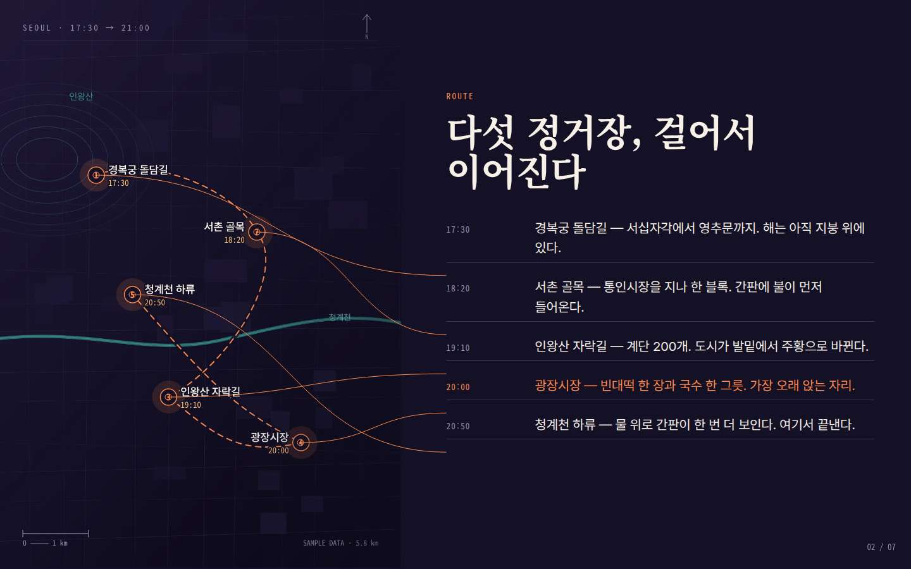
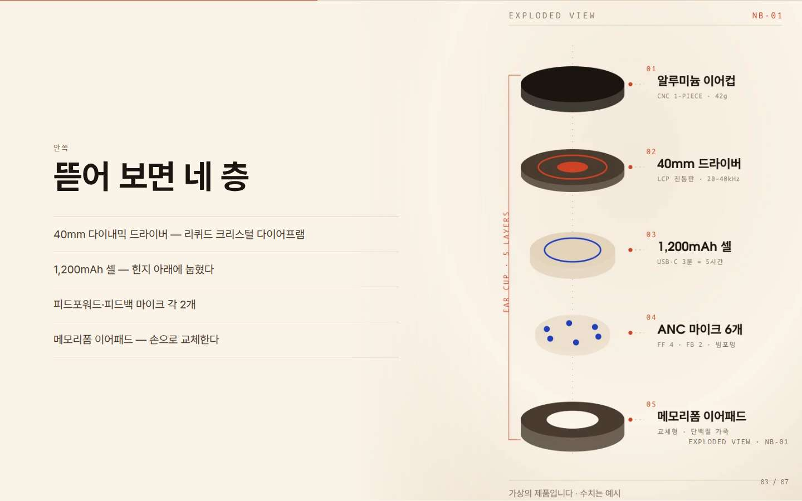
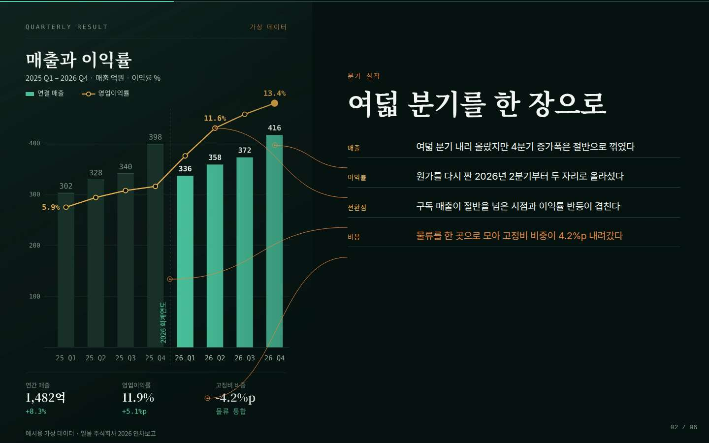
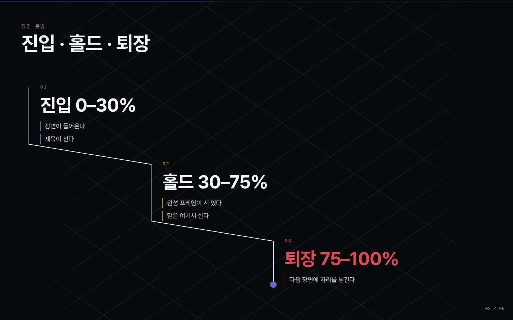
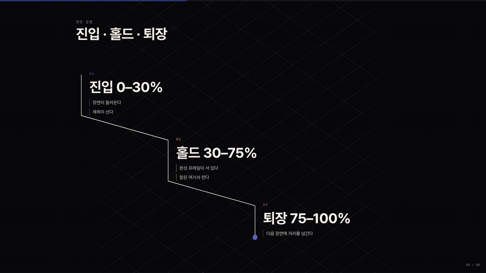

<div align="center">

# Scrolline Deck

**Scroll-driven cinematic HTML presentations — a scrollytelling deck you can present from.**

One notch of the wheel is not the next slide. It is the next frame of the scene you are already in.

[](https://github.com/gongnyang/awesome-html-scrolline-deck/actions/workflows/ci.yml)
[](LICENSE)


[한국어 README](README.ko.md) · [Skill router](SKILL.md) · [Live examples](https://gongnyang.github.io/awesome-html-scrolline-deck/)

</div>

<table>
<tr>
<td width="50%"><a href="https://gongnyang.github.io/awesome-html-scrolline-deck/city-guide/"></a></td>
<td width="50%"><a href="https://gongnyang.github.io/awesome-html-scrolline-deck/product-launch/"></a></td>
</tr>
<tr>
<td width="50%"><a href="https://gongnyang.github.io/awesome-html-scrolline-deck/annual-report/"></a></td>
<td width="50%"><a href="https://gongnyang.github.io/awesome-html-scrolline-deck/sample-deck/"></a></td>
</tr>
</table>

<sub>Every image above is a `verify` capture, taken by driving a real mouse wheel through a deck. Every picture inside the decks is a vector infographic drawn by a script. Nothing here is a mockup. <b>Click a capture to open the live deck.</b></sub>

---

## One-minute demo

<a href="docs/demo.mp4"></a>

<sub>Full 59-second trailer: <a href="docs/demo.mp4">docs/demo.mp4</a> (1080p). Every shot is a real deck driven by real wheel events; the score is synthesised in ffmpeg. Regenerate with <code>tools/demo/</code>.</sub>

## Live examples

Four decks, four concepts, all generated and gate-verified by the skill. Open one and scroll, or press <b>→</b>.

| deck | concept | theme | scenes | open |
|---|---|---|---|---|
| [`examples/sample-deck`](examples/sample-deck/) | the tool explaining itself | dark, purple | 6 | [▶ open](https://gongnyang.github.io/awesome-html-scrolline-deck/sample-deck/) |
| [`examples/product-launch`](examples/product-launch/) | 「Nimbus」 headphone launch: 90 drawn rotation frames, exploded view, feature charts, spec odometer | **light**, cream + coral | 7 | [▶ open](https://gongnyang.github.io/awesome-html-scrolline-deck/product-launch/) |
| [`examples/annual-report`](examples/annual-report/) | fictional annual results: chart anatomy, six report pages fanning, KPI odometer, structure wipe | dark, forest + amber | 6 | [▶ open](https://gongnyang.github.io/awesome-html-scrolline-deck/annual-report/) |
| [`examples/city-guide`](examples/city-guide/) | Seoul at dusk: 100 drawn skyline frames, route-map anatomy, postcards, cost/time compare | dark, twilight | 7 | [▶ open](https://gongnyang.github.io/awesome-html-scrolline-deck/city-guide/) |

Gallery of all four: **https://gongnyang.github.io/awesome-html-scrolline-deck/** — rebuilt by GitHub Pages on every push (`scripts/site/build-examples.mjs`). Each deck folder has a README with its storyboard and the scripts that draw its assets; all figures are sample data.

## What this is

A slide deck cuts. A **scrollytelling deck** does not — each scene is pinned to the viewport while the wheel drives its progress from 0 to 1, so motion is continuous and the presenter controls the pace by scrolling. Scrolline Deck is:

- **A Claude Code skill** (`SKILL.md`) that takes a topic and an outline and authors the deck for you.
- **A CLI** (`scripts/cli.mjs`) that scaffolds a Vite project, adds scenes from 12 templates, cuts frame sequences, and runs the gates.
- **An engine** (`engine/`) built on GSAP ScrollTrigger and Lenis, copied into each generated project so the deck keeps working after you stop using the tool.
- **Ten gates** (G1–G10, plus a schema check) that fail with a non-zero exit code. Six of them drive a real browser with real wheel events.

Output is a static HTML bundle you run locally or host anywhere. Deployment is out of scope on purpose.

## Install

```bash
git clone https://github.com/gongnyang/awesome-html-scrolline-deck.git
cd awesome-html-scrolline-deck
npm install
```

To use it as a Claude Code skill, symlink the repo into your skills directory:

```bash
ln -s "$(pwd)" ~/.claude/skills/scrolline-deck
```

Then ask Claude for "a scrollytelling deck about X" and it will follow `SKILL.md`.

**Requirements.** Node ≥ 20. `qrcode` is the only hard dependency. Playwright is optional — without it the browser gates report `skipped` and exit 0. `ffmpeg` is needed only for `scrolline frames`.

## Quickstart

```bash
# 1. scaffold
node scripts/cli.mjs init my-deck --title "How we ship" --style dark

# 2. add scenes (one per storyboard row; never repeat a technique back to back)
node scripts/cli.mjs add frame-scrub-hero    --id 01-hero    --kicker "2026" --title "How we ship"
node scripts/cli.mjs add horizontal-gallery  --id 02-work    --kicker "Work" --title "Six things we shipped"
node scripts/cli.mjs add closing-qr          --id 03-closing --kicker "Next" --title "Come build with us" --url https://example.com

# 3. run it
cd my-deck && npm install && npm run dev

# 4. gate it
node ../scripts/cli.mjs check .
node ../scripts/cli.mjs verify .     # writes qa/<id>-{30,55,85}.jpg
```

Read the three captures per scene: 30% should be mid-entrance, 55% should be the finished frame you talk over, 85% should be mid-exit. If 55% is not a frame you would be happy to stand in front of, the choreography is wrong, not the capture.

## The twelve techniques

| technique | what it does | reach for it when | assets | default `pinVh` |
|---|---|---|---|---|
| `frame-scrub-hero` | an image sequence scrubs behind a standing title | opening the talk on an image | frames + poster | 260 |
| `word-relay` | an arrowed title hands off word by word | opening the talk on a sentence | none | 220 |
| `kinetic-titles` | numbered titles assemble along a diagonal | showing the shape of the session | none | 240 |
| `horizontal-gallery` | vertical scroll drives a horizontal rail | showing many images | 3–10 images | 320 |
| `anatomy-rows` | one artefact splits into annotated rows | taking one thing apart | 1 image | 300 |
| `frame-scrub-video` | a body-copy frame scrub | showing a process that moves | frames + poster | 280 |
| `parallax-video` | an unpinned parallax pass over video | letting the room breathe (`pin: false`) | video + poster | 130 |
| `paper-assembly` | sheets converge into one body of work | proving there is a body of work | 3–8 images | 260 |
| `odometer-stats` | figures roll up on reels and land | landing a number | none | 220 |
| `wipe-transform` | one surface wipes into the next | showing A becoming B | 2–5 images, video optional | 300 |
| `tilt-card` | a portrait held under a slow tilt | introducing a person | 1 image | 200 |
| `closing-qr` | QR, URL and a way back to scene one | handing the room a link | qr.svg | 200 |

`references/techniques.md` is the canonical list; the numbers above track it.

## `deck.json`

The whole deck is one data file. Scene folders carry the motion; this carries the meaning.

```jsonc
{
  "title": "Scrolline Deck",
  "lang": "en",
  "presenter": { "name": "gongnyang", "autoDurationSec": 180 },
  "theme": { "style": "dark", "accent": "#5e6ad2" },
  "scenes": [
    {
      "id": "01-hero",                    // must equal the src/scenes/<id>/ folder name
      "order": 1,
      "technique": "frame-scrub-hero",
      "pinVh": 260,                       // pin distance as a % of viewport height
      "pin": true,
      "assets": {
        "frames": "/frames/hero/f_%03d.jpg",
        "count": 120,
        "critical": [1, 30, 60, 90, 120], // decoded before the scene is allowed to start
        "poster": "/frames/hero/poster.jpg"
      },
      "copy": { "kicker": "2026", "title": "How we ship", "lines": ["One line, maybe two."] },
      "notes": "Required. Shown in the N panel while you present.",
      "fallback": "Poster still plus a faded-in title, for reduced motion."
    }
  ]
}
```

Full schema: [`references/deck.schema.json`](references/deck.schema.json).

## Gates

`check` is static and needs no browser. `verify` drives Chromium with real wheel events — it never calls `scrollTo`, because a deck that only works when you teleport to a scroll position is a deck that breaks under a real wheel.

| | gate | asserts |
|---|---|---|
| **check** | G1 | every scene module exports `{ id, mount, build, unmount }` and `id` equals its folder |
| | G2 | every timeline sums to ≤ 1.001, and `order` / `pinVh` are sane |
| | G3 | no `var(` inside a tween string, plus lint L1 (no raw colour in `scene.css`), L2 (every selector scoped to `[data-scene="<id>"]`), L3 (`pathLength="1"` on animated paths) |
| | G4 | no `window.scrollTo` or `scrollIntoView` in scenes or in the verify path |
| | S0 | `deck.json` validates and every asset path exists on disk |
| **verify** | G5 | measured pin distance equals `pinVh%` of the viewport, ±2px |
| | G6 | ≥ 3 visible elements at 55% of each scene, and writes the three captures |
| | G7 | `ArrowRight` lands within 4px of 35% into the next pin, with ≥ 3 visible elements there |
| | G8 | zero `console.error` and zero page errors across the run |
| | G9 | zero horizontal overflow at 1440px and at 390px |
| | G10 | with `prefers-reduced-motion`, pin distance is 0 and every scene still shows ≥ 3 elements |

Without Playwright installed, `verify` prints how to install it, reports `skipped: true`, and exits 0 so CI stays honest instead of green-by-accident.

## Presenting

| key | action |
|---|---|
| `→` `Space` / `←` | next / previous scene, landing 35% into the pin |
| `1`–`9`, `0` | jump to scene 1–9; `0` is scene 10 |
| `P` | toggle auto-advance (`presenter.autoDurationSec`); any input stops it |
| `F` | fullscreen |
| `H` | hide the cursor |
| `N` | speaker notes panel |

Build with `npm run build && npm run preview`, and run `verify` once on the machine that will actually be on stage.

## Project structure

```
awesome-html-scrolline-deck/
├─ SKILL.md              Claude Code router: principles, workflow, technique picker
├─ engine/               runtime copied into every generated deck (no Vite API)
├─ templates/project/    Vite scaffold: index.html, tokens.css, data/deck.json
├─ templates/scenes/     12 technique templates (scene.html/css/js + template.json)
├─ references/           contract, schema, techniques, choreography, design, pitfalls
├─ scripts/              cli.mjs and cmd/ + gates/ + lib/
├─ examples/              four sample decks (sample-deck, product-launch, annual-report, city-guide)
├─ tests/                node --test: gate units, bad-* fixtures, build smoke
└─ book/                 the companion handbook (Korean, PDF in docs/)
```

## Handbook

<a href="docs/스크롤로-발표하라.pdf"></a>

**「스크롤로 발표하라」** (Korean, 46 pages, PDF in [`docs/`](docs/스크롤로-발표하라.pdf)) — a practical guide for presenters, not developers: what a scrollytelling deck is, the enter/hold/exit grammar, the one-table storyboard, how to ask Claude Code for the deck, presenting keys and rehearsal, and a teardown of a real 12-scene seminar deck.

<br clear="all" />

## Contributing

Issues and pull requests are welcome. A new scene technique needs four files under `templates/scenes/<technique>/` — `scene.html`, `scene.css`, `scene.js`, `template.json` — plus a row in `references/techniques.md` and a passing `node --test`. Keep colours in tokens, keep every timeline at or under 1, and keep the boxes out.

## License

MIT. See [LICENSE](LICENSE).

## Credits

Extracted from the twelve-scene cinema deck built for the FastCampus **"ChatGPT Astra"** seminar — <https://fc-astra-site.vercel.app/deck/>. That deck is where the pin-unit bug, the smooth-scroll `prevent` exception and the CSS-variable interpolation failure were all found the hard way; the gates in this repo exist so you do not have to find them again.

Built with [GSAP ScrollTrigger](https://gsap.com/docs/v3/Plugins/ScrollTrigger/), [Lenis](https://lenis.darkroom.engineering/) and [Vite](https://vite.dev/).
