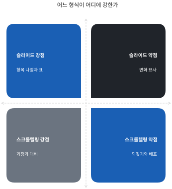

# 슬라이드가 아니라 장면이다

## 이 형식의 이름

화면을 아래로 굴리면 그림이 움직이고 글자가 들어오는 발표 화면을 본 적이 있을 것이다. 정식 명칭은 스크롤텔링, 또는 스크롤 구동 프레젠테이션이다. 뉴스 기사의 인터랙티브 기획물에서 먼저 자리를 잡았고, 지금은 제품 소개와 세미나 발표에도 쓰인다. 이름은 낯설어도 화면은 익숙할 가능성이 높다.

작동 원리는 한 문장으로 끝난다. 스크롤 위치가 곧 장면의 진행률이다. 휠을 얼마나 굴렸는지가 그대로 화면이 얼마나 진행됐는지가 된다. 휠을 한 칸 굴리면 장면이 한 칸 진행하고, 손을 떼면 그 지점에 멈춘 채로 있다. 되돌리면 장면도 되돌아간다. 화면이 알아서 재생되는 영상과 달리, 진행을 쥐고 있는 쪽은 언제나 발표자다.

::: info 한 줄 정의
스크롤텔링 덱은 스크롤 위치를 장면 진행률로 번역하는 발표 화면이다. 굴린 만큼 전개되고, 멈춘 자리에 멈춘다.
:::

이 형식이 아직 드문 이유는 기술이 어려워서가 아니다. 만드는 도구가 없었던 것도 아니다. 준비하는 순서가 다르기 때문이다. 슬라이드는 쪽을 만들면서 생각을 정리할 수 있지만, 스크롤텔링은 무엇을 어떤 순서로 보여 줄지 먼저 정해야 첫 화면이 나온다. 이 책이 제작보다 준비를 앞에 둔 이유가 그것이다. 순서만 바꾸면 나머지는 익숙한 작업이 된다.

## 슬라이드와 무엇이 다른가

슬라이드 덱은 장 단위로 끊긴다. 15쪽에서 16쪽으로 넘어갈 때 그 사이에는 아무것도 없다. 넘김은 순간이고, 내용은 정지 화면이다. 그래서 슬라이드는 목록과 표에 강하다. 여러 항목을 한 화면에 늘어놓고 손가락으로 짚어 가며 설명하기 좋다. 되돌아가기도 쉽다.

스크롤텔링 덱은 장면 단위로 흐른다. 한 장면이 0%에서 100%까지 가는 동안 화면은 계속 바뀐다. 글자가 들어오고, 사진이 옆으로 흐르고, 숫자가 올라간다. 그 사이의 중간 상태 전부가 보여 줄 수 있는 화면이다. 그래서 이 형식은 과정과 변화에 강하다.

[표] 슬라이드 덱과 스크롤텔링 덱 비교 | 자료: 저자 정리

| 항목 | 슬라이드 덱 | 스크롤텔링 덱 |
|---|---|---|
| 진행 단위 | 쪽 단위 컷 | 진행률 0~100% |
| 중간 상태 | 없음 | 전부 화면이 된다 |
| 잘하는 것 | 항목 나열과 표 | 과정과 변화 |
| 못하는 것 | 변화 과정 묘사 | 되짚어 보기 |
| 배포 형태 | 파일 한 개 | 웹 페이지 한 벌 |
| 수정 비용 | 쪽 단위로 낮음 | 장면 단위로 중간 |

차이를 한 장면으로 줄이면 이렇게 된다. 슬라이드는 완성된 그림 여러 장을 차례로 넘기는 일이고, 스크롤텔링은 한 그림이 그려지는 동안을 그대로 보여 주는 일이다. 전자는 결과만 전달하고, 후자는 결과에 이르는 길을 함께 전달한다.

## 이기는 자리와 지는 자리

이 형식이 확실히 이기는 자리는 세 곳이다. 첫째는 결과물을 보여 주는 자리다. 이미지와 영상이 주인공인 발표에서 스크롤텔링은 화면 전체를 쓴다. 슬라이드처럼 제목 줄과 여백을 남겨 둘 이유가 없다. 사진 여덟 장을 옆으로 흘려보내는 동안 발표자는 말만 하면 된다.

둘째는 변화를 설명하는 자리다. 자료가 흩어진 상태에서 한 벌로 모이는 과정, 숫자가 0에서 목표치까지 올라가는 과정은 중간 프레임이 있어야 전달된다.

셋째는 기억에 남겨야 하는 자리다. 같은 내용이라도 움직임을 타고 들어온 문장이 더 오래 남는다. 세미나의 오프닝과 클로징이 대표적이다.

되짚기가 약한 것이 가장 큰 약점이다. 슬라이드는 "12쪽으로 돌아가 주세요"가 통하지만, 여기서는 숫자 키를 눌러 장면 단위로 이동해야 한다. 장면 안의 특정 순간으로 정확히 돌아가는 것은 어렵다. 인쇄와 배포도 약하다. 웹 페이지 한 벌이므로 파일로 첨부하기 어렵고, 그대로 인쇄하면 움직임이 전부 사라진다. 두 약점 모두 형식을 고르기 전에 알고 있어야 한다.

두 약점은 준비로 덮을 수 있다. 되짚기는 질의응답에서 부를 만한 장면을 앞쪽 열 개 안에 배치해 두면 숫자 키 하나로 해결된다. 배포는 홀드 구간의 화면을 장면마다 한 장씩 캡처해 이어 붙인 백업 자료를 따로 만들어 두면 된다. 둘 다 발표 전날에 십 분이면 끝나는 준비이고, 5장의 체크리스트에 그대로 들어 있다.

::: warn 이 세 경우에는 쓰지 않는다
질의응답에서 앞 내용을 되짚어야 하는 보고, 표와 숫자가 본문인 실적 검토, 상대가 파일을 받아 혼자 읽어야 하는 제안서.
:::

## 이 책이 전제하는 것

판단이 서지 않을 때 쓰는 기준은 하나다. 발표가 끝난 뒤 그 자료를 상대가 혼자 다시 열어 볼 것 같으면 슬라이드로 만든다. 그 자리에서 보여 주고 끝날 것 같으면 스크롤텔링이 낫다. 두 형식을 섞어 쓰는 것도 가능하다. 본편은 슬라이드로 가고 오프닝과 클로징만 스크롤텔링으로 여는 구성이 실제로 흔하다. 이 책은 개발자를 독자로 두지 않는다. 자바스크립트를 쓸 줄 몰라도 된다. 대신 두 가지를 전제한다. 하나는 발표할 내용이 이미 정리돼 있다는 것이고, 다른 하나는 Claude Code를 쓸 수 있는 환경이라는 것이다. 내용이 정리돼 있지 않으면 어떤 형식으로 만들어도 결과는 같다. 나머지 장은 순서대로 읽는 것을 전제로 쓰였다. 2장은 장면 하나가 어떻게 생겼는지, 3장은 제작 전에 채워야 하는 표 한 장, 4장은 만드는 절차, 5장은 발표 당일을 다룬다. 6장은 실제로 만든 덱 하나를 뜯어본 기록이다. 시간이 없으면 6장을 먼저 읽고 1장으로 돌아와도 된다.

읽는 방식에 대해 한 가지만 덧붙인다. 이 책에 나오는 기법 이름과 명령 이름은 외우라고 적은 것이 아니다. 화면에 그 이름이 지나갈 때 무엇을 가리키는지 알아볼 수 있으면 충분하다. 사람이 결정하는 것은 장면의 순서와 문장, 그리고 완성된 화면이 쓸 만한가뿐이다.

그래서 이 책은 얇다. 규칙 몇 개와 표 한 장, 실패 사례 세 건이면 충분하다고 보았다.

### 슬라이드와 함께 쓰는 법

전부를 이 형식으로 바꿀 필요는 없다. 실무에서 가장 자주 쓰이는 구성은 앞뒤만 스크롤텔링으로 여닫고 가운데는 기존 슬라이드로 가는 방식이다. 오프닝에서 분위기를 깔고, 본편은 익숙한 도구로 설명하고, 마지막에 다시 스크롤텔링으로 닫는다. 두 화면 사이를 오가는 데 드는 비용은 브라우저 창 하나를 미리 열어 두는 것뿐이다.

이 구성의 장점은 위험이 작다는 것이다. 스크롤텔링 쪽이 발표장에서 문제를 일으켜도 본편은 그대로 굴러간다. 반대로 본편 슬라이드가 준비되지 않아도 오프닝은 이미 완성돼 있다. 처음 이 형식을 쓰는 발표라면 세 장면짜리 오프닝 하나만 만들어 보는 것으로 시작해도 충분하다.

세 장면이면 준비물은 사진 몇 장과 문장 세 개다. 만드는 데 한 시간이 걸리지 않고, 그 한 시간으로 이 형식이 자기 발표에 맞는지를 판단할 수 있다.

여기까지가 형식에 대한 이야기다. 다음 장부터는 장면을 어떻게 짜고, 어떤 표로 관리하고, 어떻게 만들어 무대에 올리는지를 차례로 다룬다. 읽는 데 한 시간, 따라 만드는 데 하루가 기준이다.

이 책의 규칙은 전부 실물 덱 한 벌에서 나왔다. 열두 장면짜리 세미나 화면을 만들고, 만든 사람이 아닌 쪽이 검수하고, 거기서 걸린 실패를 고친 기록이 6장이다. 그래서 여기 나오는 숫자는 취향이 아니라 측정값이다.
