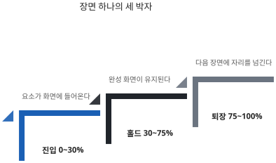

# 장면 문법: 진입·홀드·퇴장

## 한 장면은 세 박자로 끝난다

장면 하나는 0%에서 100%까지 간다. 이 구간을 세 토막으로 나눠 쓰면 어떤 소재를 얹어도 화면이 무너지지 않는다. 진입은 0%에서 30%까지다. 비어 있던 화면에 요소가 들어온다. 글자가 아래에서 올라오거나, 사진이 좁은 창에서 열리거나, 프레임 시퀀스의 첫 컷이 자리를 잡는다.

홀드는 30%에서 75%까지다. 완성된 화면이 거의 그대로 유지되는 구간이고, 발표자가 말을 얹는 자리가 여기다. 이 구간이 짧으면 관객은 화면을 읽기도 전에 다음으로 밀려간다. 퇴장은 75%에서 100%까지다. 밝기를 낮추거나, 확대하면서 암전시키거나, 덮개를 열어 다음 장면을 드러낸다.

::: quote 장면 모듈 계약
타임라인 총 길이를 1로 두고 0..1 구간에 배치하면 pinVh 를 나중에 조정해도 비율이 유지된다.
:::

세 박자가 무너졌을 때의 증상도 정해져 있다. 화면이 계속 비어 있으면 진입이 너무 늦은 것이고, 완성되자마자 사라지면 홀드가 없는 것이다. 다음 장면이 이미 보이는데 앞 장면이 남아 있으면 퇴장이 늦은 것이다. 셋 중 가장 자주 나오는 것은 첫 번째이고, 판단이 서지 않으면 진입을 앞으로 당기는 쪽을 고른다. 세 박자의 경계를 절대 시간이 아니라 진행률로 잡는 데에도 이유가 있다. 장면 길이는 나중에 바뀐다. 리허설에서 "3번 장면이 너무 빨리 지나간다"는 말이 나오면 그 장면의 길이만 늘린다. 이때 안무가 진행률로 적혀 있으면 비율이 그대로 유지되고, 초 단위로 적혀 있으면 전부 다시 계산해야 한다.

장면 길이는 pinVh라는 값 하나로 정한다. 뷰포트 높이를 100으로 놓았을 때 그 장면이 몇 배만큼 스크롤을 먹는지를 뜻한다. 260이면 화면 두 개 반 남짓을 굴려야 그 장면이 끝난다. 기법마다 기본값이 정해져 있고, 가장 짧은 것이 130, 가장 긴 것이 320이다.

기본값을 바꿀 일은 생각보다 자주 생긴다. 리허설에서 말이 남는 장면, 사진을 한 장 더 넣기로 한 장면, 설명을 줄이기로 한 장면이 모두 조정 대상이다. 이때 손대는 것은 표의 숫자 하나뿐이고 장면 안의 안무는 그대로 둔다. 안무가 비율로 적혀 있기 때문에 가능한 일이다. 이 값을 초 단위로 바꿔 생각하지 않는 편이 낫다. 같은 길이라도 발표자가 빨리 굴리면 몇 초에 지나가고 천천히 굴리면 그 몇 배가 걸린다. 길이는 시간이 아니라 분량이고, 시간을 결정하는 쪽은 언제나 손이다. 자동 진행을 켰을 때만 길이가 시간으로 환산된다. 그래서 리허설에서 재는 것은 초가 아니라 굴리는 손의 속도다. 같은 덱을 두 사람이 굴리면 전체 시간이 다르게 나오는 것이 정상이다.

## 재료 없이 서는 네 기법

기법은 열두 가지를 쓴다. 외울 필요는 없고, 무엇을 준비해야 하는지로 세 묶음만 나눠 두면 된다. 첫 묶음은 사진도 영상도 없이 글자와 도형만으로 서는 네 가지다. 발표 준비가 늦어졌을 때 기댈 수 있는 쪽이고, 말문을 여는 자리와 수치를 못 박는 자리가 여기에 속한다. 손에 아무 재료가 없어도 이 넷은 바로 만들 수 있다.

[표] 재료 없이 서는 네 기법 | 자료: references/techniques.md

| 기법 | 무엇을 하나 | 언제 쓰나 | pinVh |
|---|---|---|---|
| word-relay | 단어를 이어 던진다 | 한 문장으로 열 때 | 220 |
| kinetic-titles | 제목이 조립된다 | 얼개를 보일 때 | 240 |
| odometer-stats | 숫자가 굴러 도착한다 | 수치를 못 박을 때 | 220 |
| closing-qr | QR과 주소를 남긴다 | 링크를 쥐여 줄 때 | 200 |

closing-qr의 QR 이미지는 따로 만들지 않아도 된다. 주소만 알려 주면 명령이 그 자리에서 만들어 넣는다. 그래서 이 넷은 손에 아무것도 없는 상태에서 바로 시작할 수 있는 기법들이고, 준비가 늦은 발표에서 가장 먼저 꺼내게 된다.

pinVh 열은 각 기법의 기본값이다. 처음 만들 때는 손대지 말고, 리허설에서 필요한 장면만 조정하면 된다.

네 기법의 쓰임은 서로 겹치지 않는다. word-relay는 한 문장을 단어 단위로 끊어 던지므로 발표의 첫 주장에 어울리고, kinetic-titles는 번호 붙은 항목이 조립되므로 차례에 어울린다. odometer-stats는 숫자가 올라가는 동안 관객의 시선이 그 숫자에 묶이고, closing-qr은 화면이 멈춘 채로 주소를 남긴다.

네 가지만으로 다섯 장면짜리 덱을 짜는 것도 가능하다. 여는 장면에 word-relay, 차례에 kinetic-titles, 본문 두 장면에 odometer-stats와 다시 kinetic-titles, 마지막에 closing-qr을 놓으면 된다. 같은 기법이 두 번 나오는 것은 두 장면을 떨어뜨려 놓으면 문제가 되지 않는다. 다섯 장면이 굴러가면 그다음은 같은 일을 몇 번 더 하는 것뿐이고, 열두 장면도 같은 방식으로 늘려 간다. 재료가 도착하면 그때 아래 두 묶음의 기법으로 갈아 끼우면 된다.

## 이미지가 필요한 다섯 기법

둘째 묶음은 사진이나 그림이 있어야 화면이 서는 다섯 가지다. 필요한 장수가 기법마다 다르고, 최소 장수를 못 채우면 화면에 빈 자리가 생긴다. 스토리보드를 짤 때 가진 이미지의 수를 먼저 세어 보고 고르는 편이 안전하다.

[표] 이미지가 필요한 다섯 기법 | 자료: references/techniques.md

| 기법 | 필요한 이미지 | 언제 쓰나 | pinVh |
|---|---|---|---|
| anatomy-rows | 1장 | 하나를 뜯어 보일 때 | 300 |
| tilt-card | 1장 | 사람을 소개할 때 | 200 |
| wipe-transform | 2~5장 | A가 B로 바뀔 때 | 300 |
| paper-assembly | 3~8장 | 작업량을 보일 때 | 260 |
| horizontal-gallery | 3~10장 | 여러 장을 보일 때 | 320 |

장수가 모자라면 기법을 바꾼다. 사진이 두 장뿐인데 갤러리를 고르면 레일이 반쯤 비어 보이고, 한 장뿐인데 조립 장면을 고르면 모을 조각이 없다. 앞 묶음의 네 기법에는 이런 제약이 없으므로, 이미지가 부족한 장면은 그쪽으로 돌리는 것이 가장 빠른 해결이다.

다섯 가지는 필요한 장수 순으로 적어 두었다. 한 장만 있으면 되는 anatomy-rows와 tilt-card가 가장 가볍다. 앞의 것은 그림 하나를 행으로 갈라 주석을 붙이고, 뒤의 것은 인물 사진 한 장을 느리게 기울인다. 둘 다 준비물이 적은 대신 화면이 조용해서 본문 구간에 어울린다.

세 장 이상이 필요한 셋은 인상이 강한 대신 준비가 무겁다. wipe-transform은 앞 화면이 뒤 화면으로 쓸려 넘어가는 대비를 만들고, paper-assembly는 낱장이 모여 한 덩어리가 되는 과정을 보여 주며, horizontal-gallery는 여러 장을 가로로 흘려보낸다. 세 기법 모두 최소 장수를 채우지 못하면 의도한 인상이 나오지 않는다. 장수가 애매하면 한 장으로 되는 두 기법 쪽으로 내려오는 편이 낫다.

다섯 기법이 요구하는 것은 장수만이 아니다. 가로로 긴 이미지여야 하고, 한 장면 안에 들어가는 이미지끼리는 밝기와 색감이 비슷해야 한다. 밝은 사진과 어두운 사진을 섞으면 레일이 지나갈 때마다 화면 밝기가 널뛴다.

## 프레임과 영상이 필요한 세 기법

셋째 묶음은 움직이는 소재가 필요한 세 가지다. 준비에 가장 손이 많이 가지만, 화면의 인상도 가장 강하다. 세 기법 모두 정지 이미지를 한 장 같이 요구한다. 영상이나 프레임이 아직 내려받아지지 않았을 때 대신 깔리는 그림이다.

[표] 프레임과 영상이 필요한 세 기법 | 자료: references/techniques.md

| 기법 | 필요한 소재 | 언제 쓰나 | pinVh |
|---|---|---|---|
| frame-scrub-hero | 프레임 시퀀스와 정지 컷 | 이미지로 열 때 | 260 |
| frame-scrub-video | 프레임 시퀀스와 정지 컷 | 과정을 보일 때 | 280 |
| parallax-video | 영상과 정지 컷 | 객석에 숨을 줄 때 | 130 |

parallax-video만 화면을 고정하지 않고 지나가면서 스크럽한다. 나머지 열한 가지는 전부 화면을 고정한 채로 전개한다. 고정하지 않기 때문에 길이도 130으로 가장 짧고, 두 개의 고정 장면 사이에 끼워 숨을 돌리는 자리로 쓴다.

프레임 시퀀스를 만드는 일은 명령 하나가 맡는다. 영상 파일을 넘기면 낱장 이미지로 잘라 주고, 3장에서 다루는 장수와 우선 대상까지 자동으로 기록한다. 프레임 스크럽 두 가지의 차이는 쓰는 자리다. frame-scrub-hero는 첫 장면 전용이고, 제목이 선 채로 뒤에서 프레임이 흐른다. frame-scrub-video는 본문 구간에서 쓰며, 번호 붙은 줄이 한 박자에 하나씩 내려앉는 동안 화면이 스크럽된다. 같은 기술을 쓰지만 화면의 주인공이 다르다. 세 기법 모두 준비 시간이 가장 길다. 영상을 고르고, 프레임을 자르고, 정지 컷을 따로 만들어야 하기 때문이다. 발표까지 남은 시간이 하루뿐이라면 이 묶음은 첫 장면 하나에만 쓰고 나머지는 앞의 두 묶음으로 채우는 편이 안전하다.

## 기법을 고르는 기준

고르는 일은 네 가지 기준으로 끝난다. 첫째, 소재가 기법을 정한다. 가진 것이 사진 여덟 장이면 horizontal-gallery고, 숫자 세 개면 odometer-stats다. 기법을 먼저 고르고 소재를 끼워 맞추면 빈 자리가 생긴다. 둘째, 같은 기법을 연속으로 쓰지 않는다. 앞 장면과 같은 움직임이 두 번 반복되면 관객은 진행이 멈춘 것으로 받아들인다. 프레임 스크럽을 오프닝에 썼다면 다음 프레임 스크럽은 세 장면 뒤에 둔다.

::: tip 한 장면에 메시지 하나
장면 하나가 전달하는 문장은 하나다. 두 개를 넣고 싶으면 장면을 둘로 쪼갠다.
:::

셋째, 오프너와 클로저는 고정한다. 첫 장면은 frame-scrub-hero 또는 kinetic-titles, 마지막 장면은 closing-qr을 쓴다. 넷째, 박스를 쓰지 않는다. 테두리를 두른 상자가 화면에 들어오면 그 안쪽은 정지 화면이 되고, 움직임은 상자 껍데기만 타게 된다. 구분이 필요하면 상자 대신 가로선 하나나 화면 끝까지 닿는 이미지를 쓴다. 장면 수는 발표 시간을 1.5분으로 나눈 값이고, 다섯에서 열둘 사이로 자른다. 10분 발표면 일곱 장면, 18분을 넘기면 열두 장면 상한에 붙고 장면마다 말할 시간이 늘어난다. 60분 세미나가 열두 장면인 이유가 그것이다. 다섯 아래로 내려가면 이 형식을 쓸 이유가 없고, 열두 장면을 넘어가면 숫자 키로 닿지 않는 장면이 생긴다.

장면 수가 정해지면 전체 스크롤 길이도 따라 나온다. 기법별 기본값이 130에서 320 사이이므로, 열두 장면이면 대략 1,600에서 3,800 사이에 들어온다. 6장에서 해부하는 실물 덱은 2,450이었다. 길이는 처음부터 정확할 필요가 없다. 표에 기본값을 적어 두고 만든 뒤, 리허설에서 말이 남거나 모자라는 장면만 한 번에 하나씩 조정하면 된다. 기법 이름은 분류표이지 암기표가 아니므로, 하고 싶은 동작을 먼저 적고 그에 해당하는 이름을 표에서 찾아 옮기면 된다.

기법이 정해지지 않는 장면이 하나쯤 남는 것도 정상이다. 그럴 때는 그 장면을 앞뒤 장면에 나눠 붙이거나 통째로 지운다. 억지로 기법을 붙인 장면은 리허설에서 가장 먼저 걸리고, 결국 발표 전날 지우게 된다. 장면 하나를 지우는 것은 손해가 아니라 발표 시간을 되찾는 일이다.

정리하면 이 장은 세 가지를 정했다. 장면은 진입과 홀드와 퇴장으로 완결되고, 안무는 시간이 아니라 비율로 적으며, 기법은 가진 재료가 정한다. 다음 장은 그 재료와 문장을 표 한 장으로 모으는 방법이다.

넘어가기 전에 세 박자를 한 번 더 확인해 두면 좋다. 이 장에서 정한 규칙 가운데 나머지 전부가 기대고 있는 것이 그 구조이기 때문이다. 캡처를 읽는 법도, 키를 눌렀을 때 화면이 내려앉는 지점도, 검수에서 걸린 실패의 원인도 전부 세 박자 위에서 설명된다.

장면을 처음 짜 볼 때는 세 구간을 기계적으로 나눠 두고 시작하는 편이 낫다. 익숙해지면 소재에 따라 비율을 조금씩 옮기게 되는데, 그때도 홀드가 전체의 절반 아래로 내려가지 않게만 지키면 된다. 홀드가 좁아진 장면은 예외 없이 리허설에서 다시 손대게 된다. 발표자가 말할 자리를 먼저 확보하고 나머지를 배분한다고 생각하면 실수가 줄어든다. 진입과 퇴장은 그 자리를 만들기 위한 앞뒤 여백에 가깝다. 여백이 넓으면 정작 말할 자리가 좁아진다.
