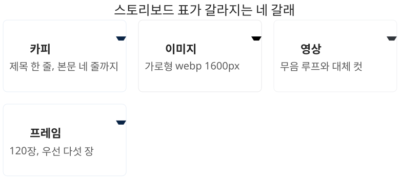

# 준비물은 표 한 장이다

## 제작 전에 채우는 단 하나의 문서

스크롤텔링 덱을 만들기 전에 준비할 것은 표 한 장이다. 디자인 시안도, 원고도, 콘티 그림도 아니다. 장면마다 한 줄씩, 일곱 칸을 채운 표다. 이 표가 채워지면 제작은 기계적인 작업이 되고, 채워지지 않으면 만드는 도중에 계속 되돌아오게 된다.

표의 열은 전부 사람 말로 쓴다. 기술 용어는 기법 이름 하나뿐이고, 나머지는 발표를 준비하면서 이미 머릿속에 있는 것들이다. 빈 서식을 그리는 대신 각 칸이 무엇을 받는지를 먼저 익히는 편이 빠르다.

[표] 스토리보드 표의 일곱 칸 | 자료: SKILL.md 저작 워크플로

| 칸 | 무엇을 적나 | 예 |
|---|---|---|
| 번호 | 장면 순서와 이름 | 04-gallery |
| 기법 | 2장의 열두 가지 | horizontal-gallery |
| 머리말 | 화면 위에 붙는 한 마디 | 세션 3 |
| 제목 | 전달할 문장 하나 | 전부 프롬프트입니다 |
| 본문 | 제목을 받치는 줄 | 촬영은 없었습니다 |
| 소재 | 그 장면에 얹을 재료 | 이미지 여덟 장 |
| 길이 | 기법의 기본 pinVh | 320 |

마지막 길이 칸을 빠뜨리기 쉽다. 2장의 표에서 기법을 고르면 기본값이 같이 따라오므로, 처음에는 그 숫자를 그대로 옮겨 적으면 된다. 이 칸이 비어 있으면 리허설에서 속도를 조정할 때 어디를 고쳐야 할지 알 수 없다.

## 카피 규칙

제목은 한 줄이다. 두 줄로 넘어가는 순간 움직이는 화면에서는 읽히지 않는다. 한국어 기준 스무 자 안쪽을 권한다. 본문은 네 줄까지 들어간다. 다만 네 줄을 다 쓰는 장면은 드물고, 두세 줄에서 끊는 편이 읽힌다.

::: tip 제목은 문장으로 쓴다
"이미지 생성"이 아니라 "여기 있는 그림은 전부 프롬프트 한 장입니다"로 쓴다. 명사구는 목차에 어울리고, 장면에는 문장이 어울린다.
:::

관객은 화면을 읽는 동시에 설명을 듣는다. 제목이 문장이면 이미 절반이 설명된 상태에서 발표자의 말이 얹힌다. 명사구를 쓰면 관객이 그 명사를 해석하는 동안 발표자의 첫 문장이 지나가 버린다.

한국어 줄바꿈도 미리 정한다. 브라우저는 긴 제목을 글자 단위로 끊어 버리는 경우가 있어서, 어디서 줄을 바꿀지 표에 적어 두는 편이 안전하다. 6장의 검수 기록에 제목이 낱자로 꺾여 앞 블록을 덮은 사례가 있다.

## 이미지와 영상

이미지는 가로로 긴 것을 쓴다. 화면 전체를 채우는 것이 기본이라서 세로 사진은 좌우에 빈 자리를 만든다. 폭은 1600픽셀 안쪽으로 줄이고 webp로 저장한다. 발표장 네트워크는 대체로 느리고, 장면 하나에 여덟 장이 들어가는 경우도 있다.

영상은 소리 없이 재생된다는 전제로 고른다. 자동 재생되는 영상에 소리가 붙어 있으면 브라우저가 재생을 막는다. 발표용 영상은 대사 없는 루프가 적합하다. 영상을 쓰는 장면에는 정지 이미지를 한 장 반드시 같이 준비한다.

대체본이 없으면 그 장면은 검은 화면으로 시작한다. 발표장에서 영상이 뜨지 않는 원인은 대체로 네트워크이고, 그때 화면에 남는 것은 대체 이미지뿐이다. 이것이 있으면 최악의 경우에도 화면은 성립한다.

::: warn 대체본을 나중에 만들지 않는다
정지 이미지와 저해상도 대체본은 영상보다 먼저 준비한다. 발표 전날 밤에 "영상이 안 뜨는데요"를 만나면 만들 시간이 없다.
:::

### 프레임 시퀀스

영상을 스크롤에 맞춰 앞뒤로 굴리려면 영상 파일이 아니라 낱장 이미지 묶음이 필요하다. 영상은 임의 지점으로 즉시 이동하지 못하지만, 낱장 이미지는 스크롤 진행률에 따라 곧바로 바꿔 끼울 수 있다. 첫 장면에서 프레임이 손을 따라오는 느낌은 이 구조에서 나온다.

6장에서 해부하는 덱의 첫 장면은 120장을 썼다. 초당 12장으로 뽑으면 10초 분량이다. 이 정도가 부드러움과 용량이 균형을 이루는 지점이다. 장수를 늘리면 부드러워지지만 내려받을 양이 그만큼 늘어난다.

전부 내려받을 때까지 기다리지는 않는다. 첫 장, 중간 몇 장, 마지막 장만 먼저 받아 두면 화면은 곧바로 성립하고 나머지는 발표 중에 채워진다. 실물 덱은 1·30·60·90·120번 다섯 장을 우선 대상으로 지정했다.

## 표를 채우는 순서

칸을 왼쪽부터 채우지 않는다. 제목 열을 먼저 전부 채운다. 장면마다 전달할 문장 하나씩을 쭉 적어 놓고 위에서 아래로 읽어 보면, 그 자체가 발표의 뼈대가 된다. 여기서 말이 안 되면 어떤 기법을 붙여도 말이 되지 않는다.

제목이 정해진 다음에 소재 열을 채운다. 가진 재료가 없는 장면이 드러나는 지점이 여기다. 재료가 없으면 장면을 지우거나, 2장의 첫 묶음, 그러니까 재료 없이 서는 네 기법으로 돌린다. 기법 열은 마지막이고, 기법이 정해지면 길이 칸은 기본값을 옮겨 적는 것으로 끝난다.

자주 빠뜨리는 칸은 두 개다. 하나는 발표자 노트다. 장면마다 무엇을 말할지 한두 줄로 적어 두는 칸인데, 이 칸이 비어 있으면 리허설에서 장면과 말이 어긋나는 지점을 찾기 어렵다. 다른 하나는 마지막 장면의 링크다. 주소가 늦게 정해지면 그 장면만 다시 만들어야 한다.

표 한 장이 다 채워지면 세 가지가 동시에 결정된다. 발표의 순서, 각 장면에서 할 말, 그리고 필요한 재료의 목록이다. 그래서 표를 채우는 일은 준비 작업이 아니라 기획 그 자체다. 완성된 표는 발표가 끝난 뒤에도 남아 인수인계 문서가 된다.

### 재료를 구하지 못했을 때

사진도 영상도 없는 상태에서 발표가 잡히는 경우가 있다. 이때 흔히 저지르는 실수는 인터넷에서 아무 이미지나 가져와 채우는 것이다. 출처가 불분명한 사진은 발표 자체의 신뢰를 깎고, 화면을 가득 채우는 이 형식에서는 그 사진이 화면의 전부가 되므로 위험이 더 크다.

대안은 두 가지다. 하나는 2장의 첫 묶음, 그러니까 word-relay·kinetic-titles·odometer-stats·closing-qr 네 가지만으로 덱을 짜는 것이다. 단어가 날아들고, 제목이 조립되고, 숫자가 굴러 올라가는 장면들만으로도 다섯에서 여섯 장면짜리 덱이 성립한다. 글자와 도형만 쓰는 화면은 오히려 프로젝터에서 더 잘 읽힌다.

다른 하나는 직접 만든 것을 쓰는 것이다. 작업 중인 문서의 화면, 손으로 그린 도식, 회의에서 쓴 화이트보드 사진은 전부 재료가 된다. 완성도가 낮아 보여도 출처가 자기 것이라는 점에서 인터넷 사진보다 낫고, 발표 내용과 정확히 맞는다는 점에서 훨씬 낫다.

세 번째 선택지는 장면을 줄이는 것이다. 재료가 없으면 여덟 장면으로 만들 것을 다섯 장면으로 만든다. 빈 화면 세 개보다 꽉 찬 화면 다섯 개가 언제나 낫다.

이 장에서 다룬 것을 한 줄로 줄이면, 준비는 파일을 모으는 일이 아니라 표를 채우는 일이라는 말이 된다. 파일은 표가 요구하는 만큼만 있으면 되고, 표가 비어 있으면 파일이 아무리 많아도 화면은 만들어지지 않는다.

표를 다 채웠는지 확인하는 방법은 간단하다. 소재 칸을 세로로 훑어보면서 지금 손에 없는 것이 몇 개인지 센다. 셋 이상이면 아직 제작에 들어갈 때가 아니다. 그 세 장면은 만들어 두어도 빈 화면으로 남고, 재료가 도착하면 결국 다시 손대게 된다.

제목 칸도 같은 방식으로 훑는다. 제목만 위에서 아래로 읽었을 때 발표 한 편이 들리면 표는 완성된 것이고, 중간에 말이 끊기면 그 자리에 장면이 하나 빠졌거나 순서가 잘못된 것이다. 이 확인은 몇 분이면 끝나고 제작 시간을 몇 시간 아껴 준다. 두 열만 훑어도 준비가 끝났는지 아닌지가 갈린다. 표가 채워졌으면 이제 만들 차례다. 다음 장은 그 표를 그대로 넘겨 주고 화면을 받아 오는 절차다.
