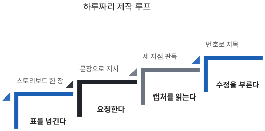
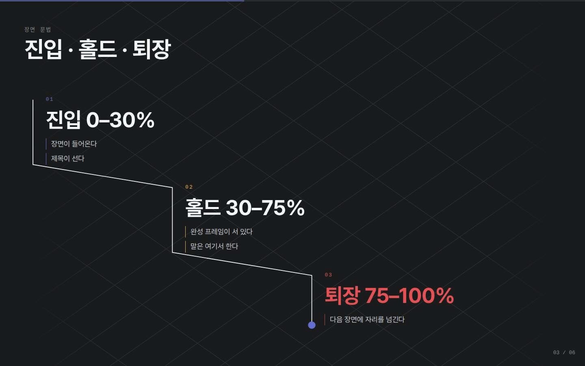
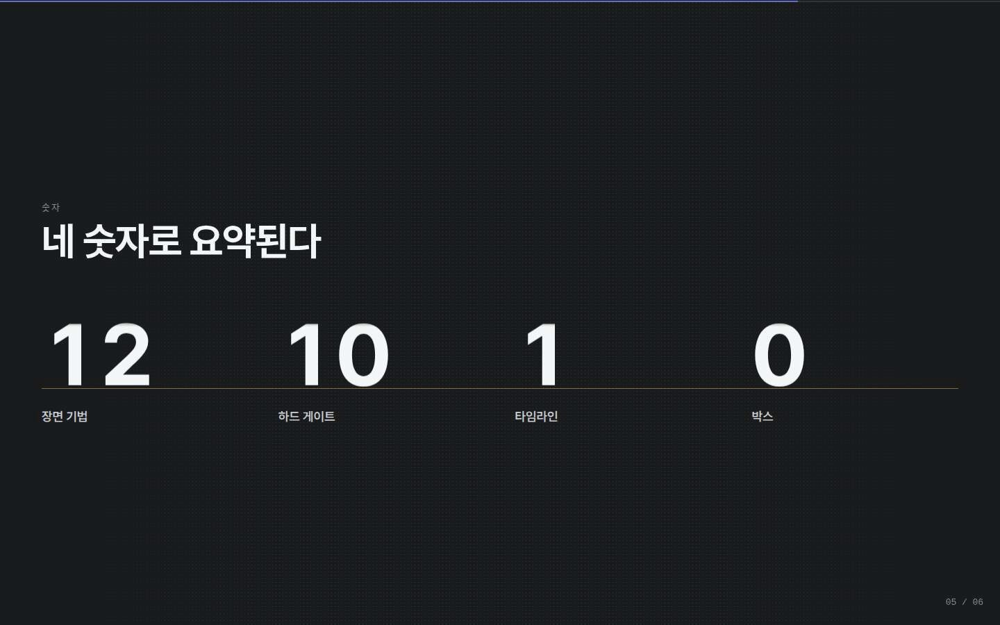
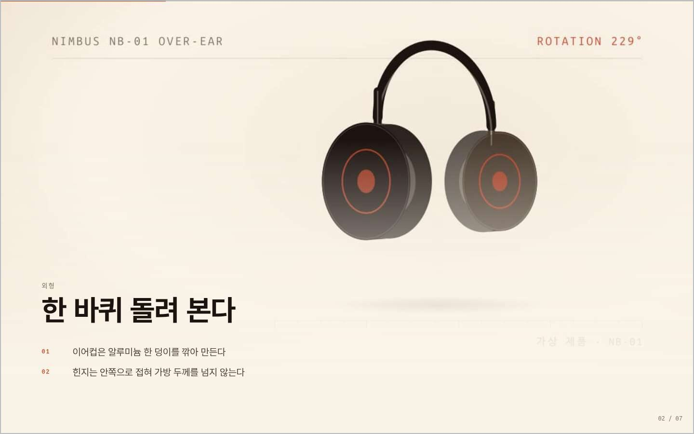
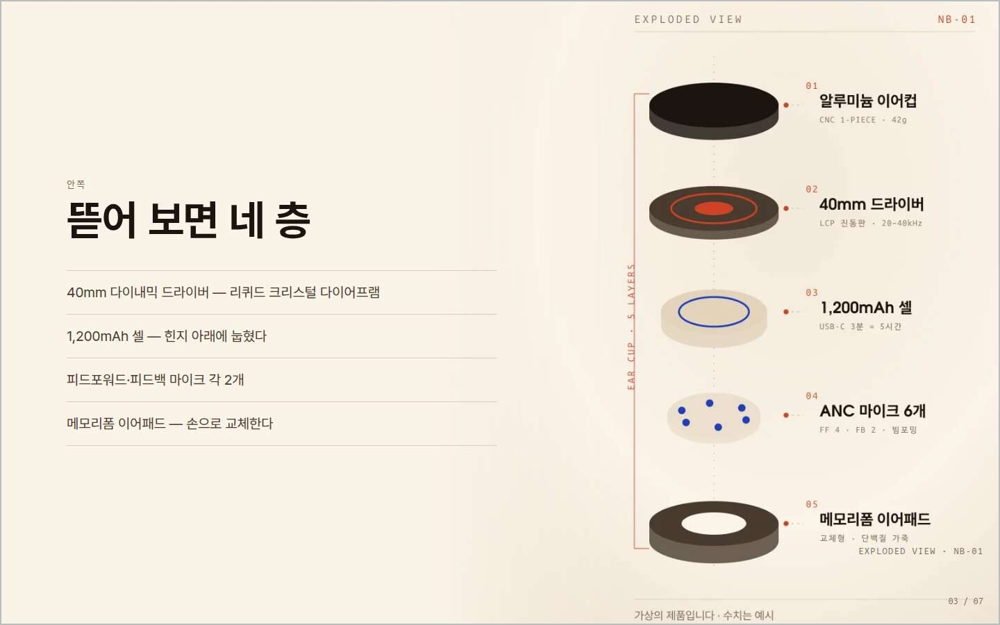
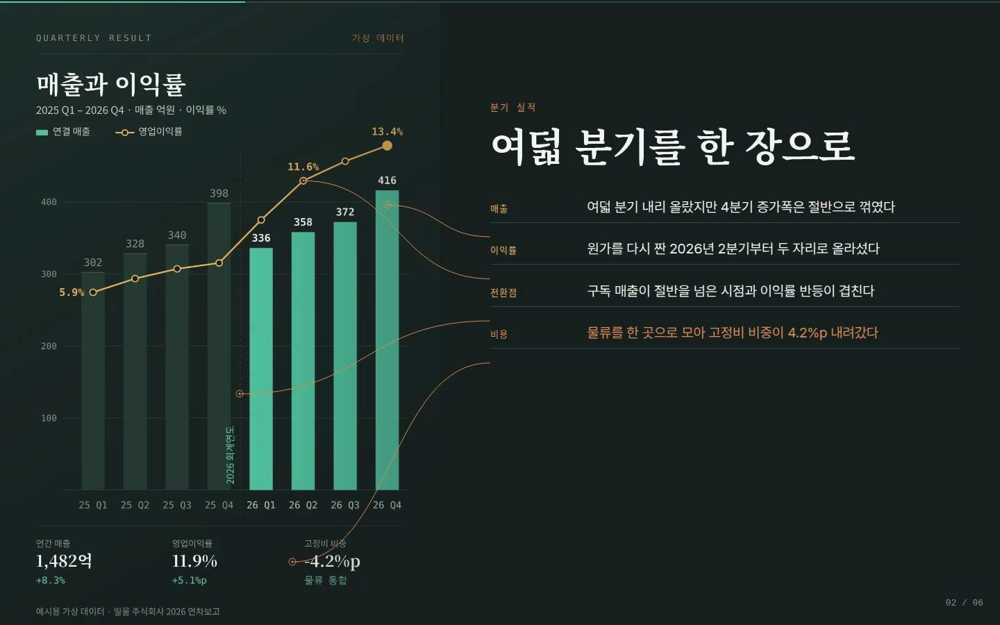
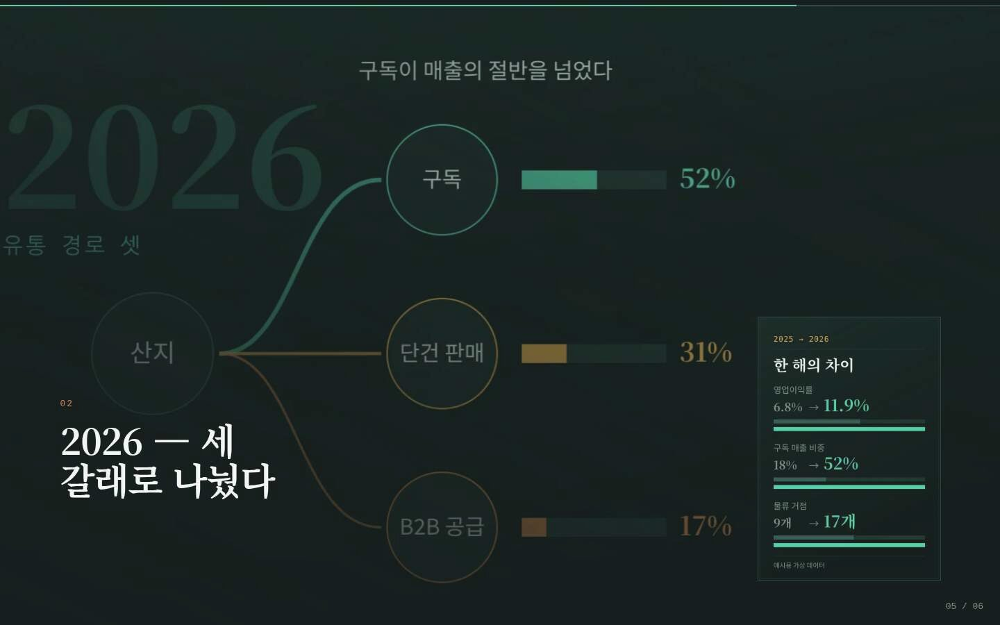
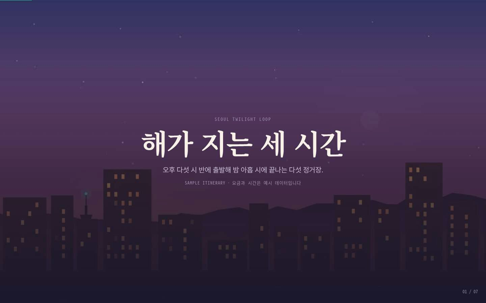
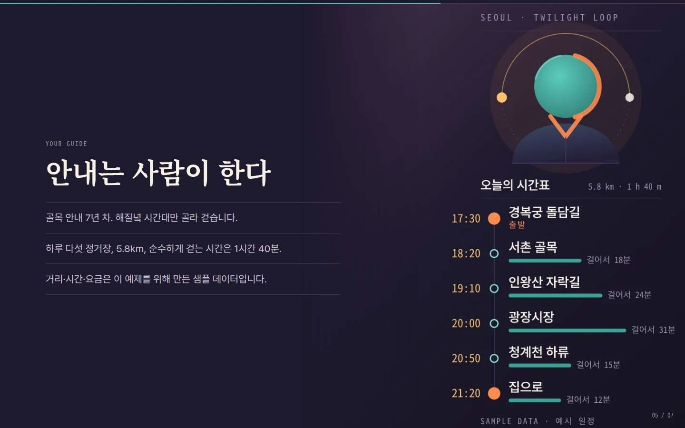

# 덱을 Claude Code로 만든다

## 스킬을 설치한다

이 형식을 만드는 일은 스킬 하나로 포장돼 있다. 스킬은 Claude Code가 특정 작업을 할 때 꺼내 읽는 지시서 묶음이다. 설치는 내려받아서 스킬 폴더에 연결하는 두 줄이고, 한 번 해 두면 다음 덱부터는 건너뛴다. 아래 두 줄을 터미널에 그대로 붙여 넣으면 된다.

```
git clone https://github.com/gongnyang/awesome-html-scrolline-deck
cd awesome-html-scrolline-deck
ln -s "$PWD" ~/.claude/skills/scrolline-deck
```

세 줄을 순서대로 붙여 넣으면 된다. 설치가 됐는지는 `node scripts/cli.mjs help` 한 줄로 확인한다. 명령 목록과 열두 가지 기법 이름이 출력되면 정상이고, 아무것도 나오지 않으면 연결 경로를 다시 본다. 설치 위치는 어디든 상관없지만, 한 번 정한 뒤에는 옮기지 않는 편이 낫다. 스킬 폴더의 연결은 경로를 그대로 기억하기 때문에, 내려받은 폴더를 나중에 다른 디스크로 옮기면 연결이 끊긴다. 옮겼다면 연결을 지우고 같은 명령으로 다시 걸면 된다. 내려받은 폴더의 예제 폴더 아래에는 이 스킬로 만든 덱 네 벌이 검증 캡처와 함께 들어 있고, 그 네 벌의 실제 화면은 이 장 끝에서 다시 본다.

스킬이 하는 일은 지시서를 제공하는 것까지다. 실제 덱은 별도의 폴더에 만들어지고, 그 폴더는 스킬과 독립적으로 움직인다. 스킬을 지워도 이미 만든 덱은 그대로 열리고, 스킬을 새 버전으로 바꿔도 기존 덱이 바뀌지 않는다. 발표가 끝난 뒤 덱만 남기고 스킬을 정리해도 아무 문제가 없다는 뜻이다.

설치가 끝나면 Claude Code를 열고 만들고 싶은 것을 말하면 된다. 스킬 이름을 부르지 않아도 되고, "스크롤로 넘어가는 발표자료"처럼 형식만 말해도 이 지시서가 불려 온다. 이 장의 나머지는 그 대화가 어떻게 흘러가는지를 순서대로 보여 준다. 요청하는 문장, 그 문장이 부르는 명령, 그리고 결과를 확인하는 그림까지가 한 묶음이다. 순서를 외울 필요는 없고, 막히는 지점에서 해당 절만 펼치면 된다.

## 요청 문장 여섯 개

3장에서 채운 스토리보드 표를 그대로 붙여 넣는 것으로 시작한다. 이후의 대화는 여섯 가지 문장 형태를 벗어나지 않는다. 표가 이미 채워져 있으면 두 번째 문장부터는 거의 확인 작업이다.

[표] 요청 문장 여섯 개와 기대 결과 | 자료: SKILL.md 저작 워크플로

| 단계 | 요청 문장 | 기대 결과 |
|---|---|---|
| 인테이크 | 60분 덱을 스크롤텔링으로 | 장면 수 제안 |
| 스토리보드 | 이 표대로 짜 줘 | 표 확인 요청 |
| 생성 | 표대로 만들어 줘 | 장면 폴더 생성 |
| 에셋 | 이 사진을 4번 장면에 | 이미지 배치 |
| 카피 | 5번 제목을 이 문장으로 | 문구 교체 |
| 검증 | 검사 돌리고 실패만 | 결과와 캡처 |

여섯 문장 가운데 사람이 가장 오래 붙잡는 것은 두 번째다. 나머지 다섯은 표가 정해지면 기계적으로 따라온다.

순서를 지키는 것도 중요하다. 스토리보드를 합의하기 전에 생성을 요청하면, 만들어진 장면을 보고 표를 고치게 되어 두 번 일하게 된다. 표를 먼저 확정하고 그다음에 만드는 순서만 지켜도 제작 시간이 눈에 띄게 줄어든다.

### 장면은 번호로 지목한다

문장을 쓸 때 지켜야 할 규칙은 하나다. 장면을 부를 때 언제나 번호로 부른다. "두 번째 갤러리 장면 말고 그 앞에 나오는 거"라고 쓰면 엉뚱한 장면이 바뀐다. 스토리보드 표의 번호가 그대로 장면 폴더 이름이 되기 때문에, 번호로 지목하면 사람과 도구가 같은 것을 가리키게 된다.

::: tip 번호와 증상을 함께 적는다
"4번 장면 55% 캡처에서 사진이 두 장밖에 안 보여"처럼 쓴다. 원인을 짐작해 적을 필요는 없다. 위치와 증상만 정확하면 된다.
:::

명령을 직접 칠 일도 거의 없다. 아래에 나오는 명령들은 Claude가 대신 실행하고, 이 장에 적어 두는 이유는 화면에 무엇이 지나가는지 알아볼 수 있게 하기 위해서다. 사람이 하는 일은 요청 문장을 쓰는 것과 캡처를 읽는 것 두 가지다.

## 생성·확인·판독이 도는 루프

생성 단계에서 실행되는 명령은 두 개다. 프로젝트를 만드는 init과 장면을 하나씩 붙이는 add이고, 스토리보드 표의 행 수만큼 add가 반복된다. 에셋 단계에는 영상을 낱장 이미지로 자르는 frames, 이미지를 장면 폴더로 옮기는 media, 클로징에 넣을 QR 코드를 만드는 qr이 있다. 확인은 두 단계로 나뉜다. 브라우저 없이 코드만 보는 check는 장면 코드의 모양, 안무가 진행률 1을 넘지 않는지, 색을 직접 박아 넣지 않았는지, 스크롤 위치를 강제로 옮기는 부분이 없는지, 표에 적은 파일이 실제로 있는지를 본다. 몇 초 만에 끝나고 고칠 곳을 정확히 짚어 준다.

브라우저를 띄워 휠을 굴려 보는 verify는 여섯 가지를 본다. 장면 길이가 표와 일치하는지, 장면 중간에 화면이 비어 있지 않은지, 화살표 키가 제 지점에 내려앉는지, 오류가 하나도 나지 않는지, 가로로 넘치는 곳이 없는지, 움직임을 끈 환경에서도 화면이 읽히는지다. 몇 분이 걸리고, 사람이 봐야 하는 그림을 만들어 준다. 여섯 항목 가운데 하나라도 어긋나면 어느 장면의 몇 퍼센트 지점에서 어긋났는지를 함께 알려 준다. 두 검사는 성격이 달라서 돌리는 시점도 자연히 갈린다.

수정할 때마다 check를 돌리고, 한 장면이 완성됐다고 판단될 때 verify를 돌린다. 이 순서를 지키면 브라우저를 띄우는 횟수가 줄고, 고칠 곳을 찾는 데 드는 시간도 짧아진다.



### 캡처 세 장을 읽는다

verify가 끝나면 장면마다 이미지 세 장이 떨어진다. 파일 이름 끝에 30, 55, 85가 붙고, 장면 진행률 30%, 55%, 85% 지점을 찍은 것이다. 세 지점은 모든 장면에서 같기 때문에 장면끼리 비교하기도 쉽다. 읽는 순서는 가운데부터다. 55% 캡처가 그 장면의 대표 화면이고, 이 한 장이 그대로 백업 자료의 한 쪽이 되기도 한다. 나머지 두 장은 이 화면이 어떻게 들어오고 나가는지를 보여 준다.

세 장이 거의 똑같아 보이면 그 장면은 움직임이 없는 것이다. 정지 화면을 스크롤로 굴리고 있을 뿐이므로 기법을 바꾸거나 안무를 다시 짜야 한다. 가운데 한 장이 비어 있으면 진입이 너무 늦거나 퇴장이 너무 이른 것이고, 2장에서 정한 세 박자 비율이 지켜지지 않았다는 신호다. 이때는 기법을 바꾸지 말고 진입 시점만 앞으로 당긴다.

30%와 85%가 똑같고 가운데만 다르면 진입과 퇴장이 같은 모양이라는 뜻이다. 들어온 길로 그대로 나가면 장면 사이의 경계가 흐려진다. 이 루프는 장면마다 몇 번씩 돈다. 캡처를 읽고 고칠 곳을 적는 시간까지 합쳐도 열두 장면짜리 덱이 하루 안에 끝나는 정도였다.

::: info 캡처 세 장이 곧 합격 기준
세 장이 각각 달라 보이고, 가운데 한 장이 그대로 발표 화면으로 쓸 만하면 그 장면은 합격이다.
:::

가장 오래 걸리는 구간은 만드는 쪽이 아니라 준비하는 쪽이다. 사진을 고르고 제목 문장을 정하는 데 드는 시간이 만드는 시간보다 길다. 3장의 표가 이미 채워져 있으면 그 시간이 앞으로 옮겨 가 있는 셈이다. 마지막으로 발표용 빌드를 만들면 폴더 하나가 남고, 그 폴더를 발표할 노트북에 옮겨 열면 그대로 돈다.

검사 결과를 다루는 방식도 정해 두는 편이 낫다. 고치기 전의 결과를 남겨 두었다가 고친 뒤 같은 검사를 돌려 통과 항목이 줄지 않았는지 본다. 화면이 마음에 드는지와는 별개로, 통과 항목이 줄었다면 그 수정은 무언가를 깨뜨린 것이다. 이 습관 하나가 마지막 날의 되돌리기를 막아 준다.

수정이 오히려 화면을 망가뜨렸을 때는 장면 단위로 되돌린다. 장면은 각자 폴더 하나에 들어 있으므로, 망가진 장면만 같은 기법으로 다시 만들고 카피를 붙여 넣으면 된다. 다른 장면은 건드려지지 않는다.

### 자주 나오는 세 가지 수정

첫째는 글자가 너무 늦게 들어오는 경우다. 30% 캡처가 거의 비어 있으면 진입이 늦은 것이고, 요청 문장은 "3번 장면 진입을 앞으로 당겨 줘"가 된다. 둘째는 글자가 사진에 묻히는 경우다. 밝은 사진 위 흰 글자는 노트북에서는 읽히고 프로젝터에서는 사라지므로, "제목 뒤에 어두운 층을 깔아 줘"로 요청한다.

셋째는 한 장면에 메시지가 둘 들어간 경우다. 55% 캡처에 문장이 두 개 보이면 그 장면은 둘로 쪼개야 한다. "4번 장면을 둘로 나눠 줘"라고 요청하면 뒤 장면 번호가 하나씩 밀리므로, 이때는 스토리보드 표도 함께 고쳐 둔다.

세 가지 모두 원인을 짐작해 적을 필요가 없다. 캡처 번호와 보이는 증상만 정확히 적으면 나머지는 진단이 맡는다. 이 장을 한 줄로 줄이면, 사람이 하는 일은 표를 넘기고 그림을 읽는 것뿐이라는 말이 된다. 명령과 검사와 수정은 전부 도구가 맡고, 판단만 사람에게 남는다.

마지막으로 발표용 빌드를 만드는 단계가 남는다. 이때 나오는 결과물은 폴더 하나이고, 그 안에 화면과 이미지와 영상이 전부 들어 있다. 발표할 노트북에 폴더를 통째로 옮겨 열면 그대로 돌아가고, 인터넷이 끊겨도 이미 내려받은 것은 그대로 뜬다. 빌드를 만든 뒤에는 발표할 그 노트북에서 검증을 한 번 더 돌린다. 만드는 데 쓴 컴퓨터와 발표에 쓸 컴퓨터가 다르면 화면 크기도 글꼴도 다를 수 있기 때문이다. 이 한 번이 5장 체크리스트의 첫 항목이다.

검증까지 통과하면 제작은 끝난 것으로 본다. 화면을 더 다듬고 싶은 마음이 남더라도, 그 시간은 발표 연습에 쓰는 편이 결과가 낫다. 관객이 기억하는 것은 움직임의 정교함이 아니라 그 화면 위에서 무슨 말을 들었는가다. 남은 것은 그 화면을 무대에서 굴리는 일이다.

제작에 쓰는 시간을 미리 정해 두는 것도 방법이다. 표가 채워진 상태에서 하루, 표부터 만들어야 하면 그보다 길게 잡는다. 이 범위를 넘어가기 시작하면 대체로 화면이 아니라 내용이 정리되지 않은 것이므로, 도구를 더 만지는 대신 3장으로 돌아가는 편이 빠르다.

한 가지 더 정해 두면 좋은 것은 고칠 목록의 길이다. 캡처를 읽다 보면 고치고 싶은 곳이 계속 늘어나는데, 한 바퀴에 세 개까지만 적고 나머지는 다음 바퀴로 미루면 루프가 짧게 돈다. 열 개를 한 번에 고치면 어느 수정이 무엇을 바꿨는지 알 수 없게 되고, 검사 결과가 나빠졌을 때 어디로 되돌릴지도 사라진다.

## 같은 도구, 네 가지 얼굴

지금까지의 규칙은 덱 한 벌에서 나왔다. 그 규칙이 그 덱에만 맞는 것인지 아닌지는 소재를 바꿔 다시 만들어 봐야 알 수 있다. 그래서 같은 스킬로 성격이 전혀 다른 네 벌을 만들었고, 네 벌 모두 스킬 저장소의 예제 폴더 아래에 코드와 검증 캡처까지 함께 들어 있다. 이 절은 그 네 벌을 나란히 놓고 각각이 무엇을 다르게 했는지 본다.

공통점부터 적어 둔다. 네 덱 모두 사진도 영상도 밖에서 가져오지 않았다. 화면에 보이는 그림은 전부 각 덱의 도구 폴더 안 스크립트가 그려서 구운 것이고, 영상도 그렇게 그린 낱장을 이어 붙인 것이다. 재료가 없어서 시작을 못 한다는 말은 이 형식에서는 성립하지 않는다는 뜻이다. 또 하나, 네 덱은 전부 정적 검사 여섯 항목과 주행 검사 열두 항목을 통과한 상태로 저장돼 있다. 앞 절에서 말한 두 단계 검사를 실제로 통과한 것만 예제로 남겼다.

다른 점은 색과 글꼴과 기법 선택이다. 하나는 거의 검은 화면에 산세리프, 하나는 크림색 바탕에 기하학 활자, 하나는 숲빛 바탕에 명조, 나머지 하나는 남보라 저녁빛에 명조다. 어느 것도 기본값 그대로가 아니고, 전부 색과 글꼴을 모아 둔 토큰 파일 한 장을 바꿔서 얻었다. 장면 파일에는 색 이름이 한 번도 나오지 않는다.

아래 네 묶음은 같은 모양으로 읽힌다. 덱이 무엇인지 두 문장, 기법을 왜 그 순서로 놓았는지, 장면 진행률 55% 지점의 캡처 두 장, 그리고 다음 덱에 그대로 옮겨 쓸 수 있는 한 가지다. 캡처 아래에 붙인 문장은 그 화면에서 발표자가 하는 말이고, 각 덱의 데이터 파일에 적힌 발표자 노트에서 가져왔다.

### 도구가 자기를 설명한다

첫 덱은 이 스킬이 자기를 설명하는 여섯 장면이다. 슬라이드처럼 끊지 않고 진행률로 민다는 주장을 글로 적는 대신, 화면이 실제로 그렇게 움직이는 것으로 보여 준다. 저장소의 시험 표본이기도 해서 검사를 돌릴 때마다 이 덱이 먼저 복사돼 설치되고 빌드된다.

기법 순서는 프레임 시퀀스, 단어 릴레이, 키네틱 타이틀, 가로 갤러리, 숫자 릴, 클로징이다. 분위기를 먼저 깔고, 한 문장을 각인시키고, 개념을 세우고, 목록을 흘려보내고, 숫자로 못 박고, 닫는다. 2장에서 나눈 묶음 순서 그대로다. 여섯 장면의 스크롤 길이를 더하면 1,460이고 말로 풀면 아홉 분쯤 된다. 여섯 값 모두 각 기법이 기본으로 들고 오는 길이를 그대로 썼다. 첫 덱에서는 길이를 손대지 않는 편이 낫다.



세 번째 장면이 이 덱에서 가장 많은 일을 한다. 진입·홀드·퇴장이라는 개념을 문장으로 설명하지 않고 계단 세 칸으로 세운다. 홀드 칸이 가장 넓고 퇴장 칸만 색이 다르다. 발표자는 세 박자를 한 번씩 짚고, 홀드 구간이 자기 시간이라는 말만 남긴 채 넘어간다.



다섯 번째 장면은 숫자 넷을 릴로 세운다. 장면 기법 열둘, 하드 게이트 열, 타임라인 하나, 박스 영이다. 마지막 영이 이 덱의 주장이고, 네 숫자가 전부 멈춘 뒤에야 발표자가 입을 연다. 숫자를 하나씩 읽지 않고 한 문장으로 묶는 것이 이 장면의 요령이다.

**훔쳐 갈 것.** 개념은 말로 설명하는 것보다 화면의 모양으로 세우는 편이 빠르다. 세 박자를 계단으로 그려 두면 관객은 듣기 전에 이미 본다. 발표에서 정의를 내려야 할 자리가 나올 때마다 그 정의를 그릴 수 있는 모양이 있는지 먼저 찾아보는 것이, 이 장면에서 가져갈 습관이다.

### 제품을 한 바퀴 돌린다

두 번째 덱은 무선 헤드폰 한 종을 소개하는 일곱 장면이다. 제품과 수치는 전부 이 예제를 위해 지어낸 것이고, 그 사실이 장면마다 화면 아래에 적혀 있으며 발표자 노트에도 소리 내어 밝히라고 적혀 있다. 앞 덱이 어두운 화면에 글자만 세운 덱이라면, 이 덱은 크림색 바탕에 판마다 인포그래픽이 하나씩 들어간 덱이다.

기법은 키네틱 타이틀, 프레임 시퀀스, 기울인 판, 가로 갤러리, 시차 영상, 숫자 릴, 클로징 일곱 가지를 하나씩 한 번만 썼다. 순서의 뼈대는 약속·외형·내부·근거·숨·스펙·마무리다. 물건을 파는 발표의 순서 그대로이고, 다섯 번째의 시차 영상만 고정 없이 지나간다. 고정하지 않는 장면은 첫 자리에도 마지막 자리에도 놓지 않는 것이 규칙이라, 고정된 두 장면 사이에 끼워 넣었다. 일곱 장면을 더하면 1,590이고 열한 분쯤 된다.



두 번째 장면은 휠을 제품 회전 손잡이로 쓴다. 낱장 아흔 장이 한 바퀴를 이루고, 관객이 굴리는 만큼 제품이 돌아간다. 오른쪽 위의 각도 표시가 지금 몇 도인지 알려 준다. 발표자는 한 바퀴가 다 돌 때까지 말을 아끼고, 아래 줄이 하나씩 내려앉을 때마다 한 문장씩만 붙인다.



세 번째 장면은 그 제품을 뜯어 놓는다. 이어컵 하나를 다섯 층으로 분해해 세우고 층마다 이름과 규격을 붙였다. 발표자는 위에서 아래로 손으로 짚어 내려오다가 네 번째 줄에서 수리해서 오래 쓰는 물건이라는 말을 얹는다. 분해도가 화면 오른쪽에만 그려져 있는 것도 이유가 있다. 이 기법이 판의 왼쪽 삼분의 일가량을 가리기 때문에, 그림을 그릴 때부터 왼쪽을 비워 두었다.

**훔쳐 갈 것.** 그림을 만들기 전에 그 그림이 놓일 자리의 모양을 먼저 확인한다. 기법마다 판을 자르는 비율과 글자가 앉는 자리가 정해져 있어서, 그것을 모르고 그리면 가운데가 잘리거나 설명이 그림 위에 겹친다. 3장에서 에셋 규격을 먼저 정하라고 한 이유가 여기서 눈에 보인다.

### 숫자를 무대에서 분해한다

세 번째 덱은 가상의 회사 한 곳의 연간 결산을 여섯 장면으로 읽는다. 회사도 숫자도 인용도 실재하지 않고, 그 사실이 생성된 그림마다 인쇄돼 있으며 여는 장면과 닫는 장면의 발표자 노트에도 들어 있다. 숲빛 바탕에 앰버와 민트를 얹고 제목은 명조로 세웠다. 보고 자료가 꼭 흰 바탕에 검은 글자여야 할 이유는 없다는 쪽에 가깝다.

기법은 단어 릴레이, 행 해부, 숫자 릴, 종이 모으기, 와이프 전환, 클로징이다. 한 문장으로 결론을 먼저 못 박고, 차트 한 장을 무대에서 분해하고, 핵심 숫자 넷을 세우고, 부속 보고서 여섯 장을 부채꼴로 모으고, 작년 구조와 올해 구조를 겹쳐 지우고, 닫는다. 결론을 앞에 놓고 근거를 뒤에 붙이는 순서인데, 보고 자리에서는 이 순서가 거의 언제나 맞다. 여섯 장면을 더하면 1,500이다.



두 번째 장면은 여덟 분기를 한 장에 담은 차트를 세워 놓고 오른쪽 행을 하나씩 읽어 내려간다. 행마다 차트 위의 한 지점으로 연결선이 뻗는다. 발표자는 차트를 삼 초쯤 그대로 보여 주고 나서 행을 읽기 시작하고, 네 번째 행에서 다음 장면의 숫자를 예고한다.



다섯 번째 장면은 작년 구조도와 올해 구조도를 같은 자리에서 겹쳐 지운다. 한 갈래였던 유통 경로가 세 갈래로 갈라지고, 구독이 매출의 절반을 넘었다는 것이 화면의 결론이다. 발표자는 와이프가 지나가는 동안 손을 들고, 두 구조도의 차이는 갈래 수가 아니라 재구매 비중이라고 말한다.

**훔쳐 갈 것.** 숫자는 한 곳에서만 나오게 한다. 이 덱은 카피에 적힌 수치와 차트가 그리는 수치와 요약 카드의 수치가 전부 같은 파일 하나를 읽는다. 카피를 고치면 차트가 같이 바뀌므로 둘이 어긋날 수가 없다. 발표 자료에서 숫자가 틀리는 사고는 거의 언제나 같은 숫자를 두 군데에 따로 적어 두었기 때문에 일어난다.

### 하루를 한 바퀴 돌린다

네 번째 덱은 서울의 저녁 한 바퀴를 일곱 장면으로 걷는다. 장소는 실재하는 곳이고 시간과 거리와 요금은 이 예제를 위해 지어낸 값이라, 숫자가 들어간 판마다 표본 데이터라고 적혀 있다. 도구가 자기 이야기를 하지 않을 때 어떤 모습이 되는지 보려고 만든 덱이다.

기법은 프레임 시퀀스, 행 해부, 종이 모으기, 시차 영상, 기울인 판, 와이프 전환, 클로징이다. 열두 기법 가운데 일곱을 하나씩 한 번만 쓰고, 같은 기법이 연달아 오지 않으며, 고정하지 않는 장면은 고정된 두 장면 사이에 있다. 순서의 뼈대는 시간·경로·기록·숨·사람·비교·마무리로 답사기의 순서 그대로다. 일곱 장면을 더하면 1,650이고 열한 분쯤 된다.



첫 장면은 해가 지는 세 시간을 배경에 맡긴다. 낱장 백 장이 노을에서 밤까지 이어지고, 굴릴수록 하늘이 어두워지면서 창문에 불이 하나씩 들어오고 마지막에 달이 뜬다. 제목은 그동안 자리에 서 있기만 한다. 발표자는 첫 문장만 말하고 프레임이 끝까지 지나갈 때까지 기다렸다가, 오늘 걷는 거리만 덧붙인다.



다섯 번째 장면은 하루 전체를 세로 시간표 한 벌로 세운다. 왼쪽에 안내하는 사람, 오른쪽에 저녁 다섯 시 반부터 아홉 시 이십 분까지의 여섯 칸이 있고, 칸마다 다음 정거장까지 걷는 시간이 막대로 붙는다. 발표자는 시간표를 손으로 짚으며 하루의 모양을 한 번 훑고, 지어낸 값이라고 밝힌 마지막 줄은 반드시 소리 내어 읽는다.

**훔쳐 갈 것.** 시간이 흐르는 일을 배경에 맡기면 발표자는 말을 줄일 수 있다. 해가 지는 세 시간을 문장으로 설명하려면 여러 줄이 필요하지만, 하늘이 어두워지는 화면 위에서는 한 줄이면 된다. 소재에 시간의 경과가 들어 있는 발표라면, 그 경과를 말이 아니라 배경이 맡을 자리가 있는지부터 본다.

### 네 덱을 직접 굴려 보기

네 덱 모두 브라우저에서 바로 열린다. 아래 주소를 그대로 치면 되고, 따로 설치할 것은 없다.

```
https://gongnyang.github.io/awesome-html-scrolline-deck/sample-deck/
https://gongnyang.github.io/awesome-html-scrolline-deck/product-launch/
https://gongnyang.github.io/awesome-html-scrolline-deck/annual-report/
https://gongnyang.github.io/awesome-html-scrolline-deck/city-guide/
```

주소에서 덱 이름을 떼면 네 덱을 한 자리에 모아 둔 목록이 나온다. 열고 나서는 휠을 굴려도 되고 오른쪽 화살표 키를 눌러도 된다. 5장에서 다룰 키가 네 덱에 전부 걸려 있으므로, 숫자 키로 장면을 건너뛰거나 자동 진행을 켜 보는 것도 같은 자리에서 된다.

코드는 저장소의 예제 폴더 아래에 덱 이름별로 들어 있다. 각 폴더의 설명 파일에는 스토리보드 표와 만들면서 걸린 문제들이 적혀 있고, 검증 폴더에는 장면마다 30·55·85 세 지점의 캡처가 함께 커밋돼 있다. 아무것도 설치하지 않고 그 덱이 무엇을 하는지 보려면 그 캡처만 열어 보면 된다. 위에 실린 여덟 장이 전부 거기서 가져온 것이다.

네 덱 가운데 하나를 그대로 출발점으로 삼는 방법도 있다. 폴더를 통째로 복사한 뒤 토큰 파일에서 색과 글꼴을 바꾸고, 장면마다 제목과 본문 줄만 자기 내용으로 갈아 끼우면 구조는 그대로 남는다. 기법 순서와 장면 길이가 이미 검사를 통과한 값이라 처음부터 짜는 것보다 손이 덜 간다. 다만 예제의 수치와 이름이 남아 있지 않은지는 반드시 확인한다. 네 덱 가운데 셋은 지어낸 값을 쓰고 있고, 그 값이 자기 발표에 섞여 들어가면 없는 사실을 말하게 된다.

어느 덱을 출발점으로 고를지는 가진 재료가 정한다. 사진도 영상도 없으면 첫 덱, 물건이나 화면을 여러 각도에서 보여 줄 것이 있으면 두 번째 덱, 숫자와 표가 중심이면 세 번째 덱, 장소와 일정이 있으면 네 번째 덱이 가장 가깝다. 3장에서 채운 표의 재료 열을 위에서 아래로 훑어보면 어느 쪽인지 대체로 한눈에 보인다.

네 벌을 만들어 보고 남은 결론은 짧다. 바뀌는 것은 색과 글꼴과 기법 선택이고, 바뀌지 않는 것은 세 박자와 스토리보드 표 한 장이다. 소재가 제품이든 결산이든 하루치 여정이든, 준비하는 사람이 붙잡고 있어야 하는 것은 늘 그 표였다.
