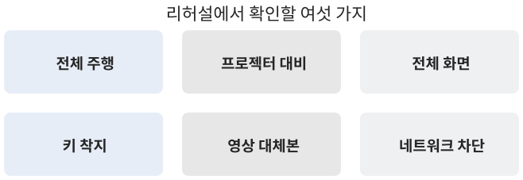

# 무대에서 굴리는 법

## 장면을 옮기는 키

무대에서 휠을 굴릴 일은 거의 없다. 실제로 쓰는 것은 키보드 몇 개이고, 프레젠터 리모컨의 다음과 이전 버튼도 화살표 키로 들어오기 때문에 그대로 작동한다. 이동에 쓰는 키는 네 가지뿐이다.

[표] 장면 이동 키 | 자료: engine/deck.js

| 키 | 동작 |
|---|---|
| 오른쪽 화살표, 스페이스 | 다음 장면으로 이동 |
| 왼쪽 화살표 | 이전 장면으로 이동 |
| 1 부터 9 | 해당 번호의 장면으로 이동 |
| 0 | 열 번째 장면으로 이동 |

숫자 키는 질의응답에서 쓴다. "아까 보여 주신 이미지 부분으로 가 주세요"에 3을 눌러 대응한다. 숫자 키로 직접 닿는 범위는 앞쪽 열 장면까지이므로, 되짚기가 잦을 것 같은 내용은 그 안에 배치해 두는 편이 낫다. 2장에서 장면 수를 열둘로 제한한 이유 가운데 하나가 이것이다. 열두 장면이면 두 번만 더 눌러 마지막까지 간다.

숫자 키가 닿지 않는 장면이 뒤에 있으면 화살표를 여러 번 눌러야 한다. 이때는 누르는 동안 중간 장면들이 빠르게 지나가므로, 질문에 답하는 흐름이 끊긴다. 되짚기가 잦을 내용을 앞쪽에 두라는 말은 이 불편을 피하라는 뜻이다.

리모컨을 쓸 때도 같은 키가 들어온다. 다음 버튼이 오른쪽 화살표, 이전 버튼이 왼쪽 화살표로 매핑되므로 손에 든 장비가 무엇이든 조작은 같다. 다만 리모컨에는 숫자 키가 없으므로, 질의응답에서 장면을 부를 때는 노트북 키보드로 돌아와야 한다.

## 화면을 다루는 키

나머지 네 가지는 장면을 옮기지 않고 화면 상태만 바꾼다. 발표 시작 직전에 두 개, 발표 중에 필요하면 나머지 두 개를 쓴다.

[표] 화면 조작 키 | 자료: engine/deck.js

| 키 | 동작 |
|---|---|
| F | 전체 화면 전환 |
| H | 마우스 커서 숨김 |
| P | 자동 진행 시작과 정지 |
| N | 발표자 노트 패널 |

F와 H는 무대에 오르자마자 한 번씩 누른다. 전체 화면으로 바꾸고 커서를 숨기면 브라우저 흔적이 사라져서 화면이 발표 자료처럼 보인다. 노트 패널은 3장에서 표를 채울 때 적어 둔 장면별 메모를 띄운다. 발표 중에 열어 두는 물건이 아니라, 무대에 오르기 직전에 한 번 훑는 용도다. 노트를 비워 둔 채로 무대에 오르면 장면은 넘어가는데 할 말이 떠오르지 않는 구간이 생긴다.

## 착지 지점 규칙

화살표 키를 눌렀을 때 화면은 다음 장면의 맨 앞이 아니라 조금 안쪽에 내려앉는다. 실물 덱은 그 장면 스크롤 구간의 35% 지점을 착지점으로 잡는다. 이 규칙에는 이유가 있다. 장면의 0% 지점은 아직 아무것도 들어오지 않은 빈 화면이고, 거기에 착지하면 관객은 검은 화면을 먼저 보게 된다.

2장에서 정한 대로 진입 구간이 30%에서 끝나므로, 35%는 화면이 막 완성된 직후이면서 홀드 구간의 시작점이다. 키를 누르자마자 완성된 화면이 뜨고, 발표자는 곧바로 말을 시작할 수 있다. 되돌아갈 때도 같은 규칙이 적용되므로, 왼쪽 화살표로 돌아온 화면 역시 비어 있지 않다.

이 규칙 덕분에 질의응답이 자연스러워진다. 숫자 키로 장면을 부르면 그 장면의 대표 화면이 즉시 뜨고, 관객은 발표 중에 봤던 것과 같은 그림을 다시 본다. 착지점이 0%였다면 질문마다 빈 화면을 한 번씩 보여 주게 된다. 이 한 가지 규칙이 질의응답의 인상을 크게 바꾼다.

## 자동 진행과 화면 환경

P를 누르면 덱이 스스로 굴러간다. 실물 덱의 자동 진행은 전체를 약 3분에 통과하도록 속도를 맞춰 두었다. 사람이 말을 얹는 속도가 아니라, 내용을 한 바퀴 돌려 보여 주는 속도다. 쓰임새는 발표 시작 전 대기 화면과 리허설 두 가지이고, 자동 진행 중에 아무 키나 누르면 즉시 멈춘다. 발표 도중 실수로 눌렀더라도 다음 화살표 한 번이면 정상으로 돌아온다.

::: tip 자동 진행은 첫 장면을 지나고 켠다
대기 화면으로 쓸 때는 첫 장면이 완성된 뒤에 P를 누른다. 0% 지점에서 켜면 빈 화면부터 굴러가기 시작해서 첫인상이 비어 보인다.
:::

발표 화면은 만든 사람의 노트북에서만 정상으로 보이기 쉽다. 만드는 동안 같은 화면을 수백 번 보기 때문에, 읽히지 않는 글자도 읽히는 것처럼 느껴진다. 실제로 화면이 무너지는 자리는 두 곳이다. 하나는 기기의 움직임 줄이기 설정이고, 다른 하나는 발표장의 프로젝터다. 둘 다 만든 사람의 책상에는 없는 조건이다. 움직임 줄이기가 켜진 기기에서는 고정과 안무가 모두 생략되고, 장면마다 완성된 정지 화면이 세로로 이어 붙는다. 이 상태는 일부러 만들어 볼 수 있다. 운영체제의 접근성 설정에서 켜고 덱을 한 번 열어 보면 된다. 이때 읽히지 않는 장면이 있으면 그 장면은 움직임에 기대고 있다는 뜻이고, 프로젝터에서도 같은 문제가 난다.

프로젝터는 노트북 화면보다 밝기와 대비가 낮다. 밝은 사진 위에 흰 글자를 얹은 장면은 노트북에서 읽히더라도 프로젝터에서는 사라진다. 6장에서 다루는 검수 기록에 이 사례가 그대로 남아 있다. 두 환경 모두 발표 전날 확인할 수 있다. 움직임 줄이기는 설정에서 켜고 한 번 열어 보면 되고, 프로젝터는 회의실 화면에 한 번 띄워 보면 된다. 확인에 드는 시간은 십 분이 되지 않는데, 이 십 분을 건너뛴 대가는 무대 위에서 치르게 된다.

## 리허설 체크리스트

당일 발표장에서 순서대로 확인한다. 전부 도는 데 십오 분 남짓이므로 발표 시작 한 시간 전에 들어가는 것을 권한다. 문제가 발견됐을 때 고칠 시간이 남아 있어야 체크리스트가 의미를 갖는다.

[표] 리허설 체크리스트 | 자료: 저자 정리

| 번호 | 확인 항목 |
|---|---|
| 1 | 발표에 쓸 노트북에서 끝까지 한 번 굴린다 |
| 2 | 프로젝터에 연결해 첫 장면 글자가 읽히는지 본다 |
| 3 | 전체 화면으로 바꾸고 커서를 숨긴다 |
| 4 | 화살표 키로 전 장면의 착지 화면을 확인한다 |
| 5 | 영상이 소리 없이 도는지, 대체 컷이 깔리는지 본다 |
| 6 | 네트워크를 끊고 새로고침해 어디까지 뜨는지 |

여섯 항목 외에 네 가지를 더 본다. 숫자 키로 되짚기가 잦을 장면 두세 개를 눌러 보고, 프레젠터 리모컨의 버튼이 화살표로 들어오는지 확인하고, 백업 자료를 바탕화면에 두고, 자동 진행을 입장 대기 화면으로 쓸지 정한다. 여섯째 항목이 가장 자주 건너뛰면서 가장 자주 사고가 나는 항목이다.

점검에서 무언가 어긋났을 때의 판단 기준은 하나다. 고쳐서 확인까지 마칠 수 있으면 고치고, 그럴 시간이 없으면 백업 자료로 간다. 발표 직전에 손을 대는 수정은 확인되지 않은 수정이고, 확인되지 않은 화면을 무대에 올리는 것보다 정지 화면으로 발표하는 편이 언제나 낫다.

발표가 끝난 뒤에 할 일도 한 가지 있다. 그날 어긋난 항목을 체크리스트 옆에 적어 두는 것이다. 발표장마다 문제가 나는 자리는 대체로 정해져 있어서, 두 번째 발표부터는 그 항목만 먼저 확인하면 된다. 프로젝터 대비와 네트워크가 가장 자주 반복되는 두 항목이다.

덱 자체도 남겨 둔다. 다음에 비슷한 주제로 발표할 때는 3장의 표만 고쳐 다시 만들면 되고, 장면 폴더 이름이 표의 번호를 그대로 따르기 때문에 어느 장면을 갈아 끼울지 표만 보고 정할 수 있다.

### 다음 발표로 넘길 것

발표가 끝나면 세 가지가 남는다. 스토리보드 표, 덱 폴더, 그리고 그날 어긋난 항목이 적힌 체크리스트다. 이 셋을 한 폴더에 같이 두면 다음 발표에서 표만 고쳐 다시 만들 수 있다.

다른 사람에게 넘길 때도 같은 셋을 넘긴다. 받는 쪽은 표를 먼저 읽고, 바꾸고 싶은 행의 번호를 정하고, 4장의 요청 문장 여섯 개로 그 행만 고치면 된다. 코드를 읽을 필요도, 어느 파일을 열어야 하는지 물어볼 필요도 없다. 장면 폴더 이름이 표의 번호와 같기 때문에 표가 곧 안내도 역할을 한다.

이것이 이 형식의 실질적인 장점이다. 화면이 화려해서가 아니라, 발표 한 편이 표 한 장으로 압축돼 남기 때문이다.

여기까지가 무대 운영이다. 키 여덟 개와 체크리스트 한 장이면 발표 당일에 필요한 것은 전부 갖춘 셈이다. 마지막 장은 이 모든 규칙이 어디에서 나왔는지, 실제로 만든 덱 하나를 열어 보이는 기록이다. 앞의 네 장이 왜 그렇게 쓰였는지가 거기에 다 들어 있다. 규칙보다 사례가 먼저 읽히는 독자라면 그 장을 먼저 펼쳐도 된다. 열두 장면을 하나씩 따라가다 보면 앞 장의 규칙이 저절로 설명된다.

정리하면 무대에서 사람이 기억할 것은 세 가지다. 화살표로 넘기고, 숫자로 되돌아가고, 문제가 생기면 백업으로 간다. 나머지 키는 발표 시작 직전에 한 번씩 누르면 끝난다.

### 리모컨과 노트북 설정

프레젠터 리모컨은 대체로 화살표 키를 흉내 낸다. 다음 버튼이 오른쪽 화살표, 이전 버튼이 왼쪽 화살표로 들어오므로 별도 설정 없이 작동한다. 다만 일부 리모컨은 다음 버튼을 페이지다운으로 보내는데, 이 경우 장면이 넘어가지 않고 화면만 조금 내려간다. 리허설에서 버튼을 한 번 눌러 보면 바로 구분된다.

노트북 쪽에서는 두 가지를 꺼 둔다. 화면 절전과 알림이다. 발표 도중 화면이 어두워지면 스크롤 위치는 그대로지만 관객은 화면이 죽은 것으로 본다. 알림은 전체 화면 위에도 뜨기 때문에 더 눈에 띈다. 둘 다 발표 시작 전에 끄고, 끝난 뒤에 되돌린다.

외부 모니터를 확장이 아니라 복제로 두는 것도 잊기 쉬운 항목이다. 확장으로 두면 발표자 화면과 프로젝터 화면이 달라져서, 키를 눌렀을 때 어느 쪽이 움직이는지 헷갈린다. 이 형식은 발표자 노트가 같은 창 안에 뜨므로 복제로 두는 편이 단순하다.
