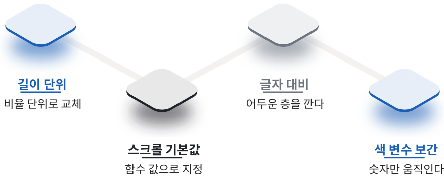

# 실전 해부: 패캠 Astra 세미나 12장면

## 덱 한눈에

이 책의 모든 규칙은 실제로 만든 덱 한 벌에서 나왔다. 2026년 9월 22일 저녁 일곱 시 반에 열리는 60분짜리 세미나를 위해 만든 발표 화면이다. 이 책을 쓴 시점은 그 이틀 전이므로, 여기 적은 것은 무대에서 굴린 기록이 아니라 제작과 검수까지의 기록이다. 세 개의 세션으로 구성됐고, 화면은 12개 장면으로 만들었다. 세션 주제는 문서와 발표자료, 글자와 이미지로 만드는 움직임, 이미지 제작과 업무 적용이었다. 세션마다 보여 줄 것이 달라서 장면 길이도 다르게 잡았다. 같은 덱 안에서도 구간에 따라 속도가 달라진다는 뜻이다.

::: stat
12
슬라이드 12쪽이 아니라, 세 박자로 완결되는 장면 12개다
:::

장면별 스크롤 길이를 모두 더하면 2,450이다. 화면 높이의 24.5배를 굴려야 처음부터 끝까지 간다는 뜻이고, 가장 긴 장면은 300, 가장 짧은 장면은 100이었다. 2장에서 말한 열두 장면 기준의 범위 안에 든다. 열두 장면 가운데 열한 개는 화면을 고정하고 그 자리에서 전개했고, 07번 하나만 고정 없이 지나가면서 스크럽했다.

장면 구성은 앞뒤 절반으로 나눠 보면 읽기 쉽다. 앞쪽 여섯은 문을 열고 결과물을 보여 주는 구간이고, 뒤쪽 여섯은 설득하고 닫는 구간이다. 제목 열만 위에서 아래로 훑어보면 그 자체로 발표 한 편의 줄거리가 된다. 3장에서 제목 열을 먼저 채우라고 한 이유가 여기서 확인된다.

아래 두 표의 제목 열은 덱 데이터 파일에 적힌 문장이고, 08번 하나만 지면 폭에 맞춰 한 어절을 줄였다. 화면에서는 이 문장이 한 줄로 크게 떠 있었고, 발표자는 그 위에 말을 얹었다.

## 앞의 여섯 장면

앞쪽 절반은 문을 열고 결과물을 보여 주는 구간이다. 첫 장면은 프레임 시퀀스 120장을 스크롤에 맞춰 굴렸고, 네 번째 장면은 가로 이미지 여덟 장을 고정 상태에서 수평으로 흘려보냈다. 여섯 장면 가운데 재료가 필요한 것은 넷이고, 나머지 둘은 글자만으로 섰다.

[표] 01번부터 06번까지 | 자료: data/scenes.json

| 번호 | 제목 | 길이 |
|---|---|---|
| 01 | 오늘 업무에 바로 쓸 수 있어요 | 250 |
| 02 | 이미지 → 영상 → PPT | 200 |
| 03 | 세 개의 세션 | 150 |
| 04 | 여기 있는 그림은 전부 프롬프트 한 장입니다 | 300 |
| 05 | 장면 · 카메라 · 조명 · 색 | 200 |
| 06 | 그 그림이 그대로 움직입니다 | 300 |

04번과 06번에 300씩 배정한 것은 의도적이다. 보여 줄 것이 많은 장면에 길이를 몰아주고, 넘어가는 장면은 짧게 끊었다. 03번 목차에 150만 준 것도 같은 이유다. 목차는 한 번 읽고 넘기는 화면이라 오래 붙잡아 둘 필요가 없다.

앞쪽 여섯의 순서에도 규칙이 있다. 01번에서 분위기를 깔고, 02번에서 오늘의 약속을 한 줄로 못 박고, 03번에서 전체 구성을 보여 준다. 여기까지가 오프닝이고 길이를 합치면 600이다. 04번부터가 본편이며, 가장 강한 장면인 갤러리를 앞쪽에 놓았다. 05번은 04번에서 보여 준 결과물을 뜯어 보는 장면이다. 결과를 먼저 보여 주고 방법을 나중에 설명하는 순서인데, 반대로 했다면 관객은 무엇을 만들려는지 모르는 채로 설명을 듣게 된다.

이 순서는 기법이 아니라 내용이 정한 것이고, 스토리보드 표의 제목 열에서 이미 결정돼 있었다. 표를 짜는 단계에서 순서가 정해지면 제작 단계에서는 그것을 바꿀 일이 거의 없다. 순서를 바꾸면 길이 배분도 같이 흔들리기 때문이다. 표에서 한 줄을 옮기는 일과 화면에서 한 장면을 옮기는 일은 비용이 다르다.

## 뒤의 여섯 장면

뒤쪽 절반은 설득하고 닫는 구간이다. 아홉 번째 장면은 숫자 릴이 굴러 올라가는 방식이었고, 마지막 장면은 QR 코드와 주소를 남겼다. 고정 없이 지나가는 07번은 영상이 배경으로 흐르는 동안 화면이 계속 움직이기 때문에 고정이 필요 없었다.

[표] 07번부터 12번까지 | 자료: data/scenes.json

| 번호 | 제목 | 길이 |
|---|---|---|
| 07 | 혼자서, 하루 만에 | 200 |
| 08 | 흩어진 자료가 한 벌이 됩니다 | 250 |
| 09 | 숫자로 보면 이렇습니다 | 150 |
| 10 | Astra로 한 번에 | 200 |
| 11 | 공냥이 | 150 |
| 12 | 지금까지 봐주셔서 감사합니다 | 100 |

마지막 장면에 100만 준 것도 의도다. 클로징은 오래 굴릴 자리가 아니라 그대로 서 있어야 하는 자리다. 반대로 08번 문서 조립에 250을 준 것은 조각이 모이는 과정 자체가 메시지이기 때문이다. 과정을 보여 주는 장면은 길이를 줄이면 메시지가 같이 사라진다.

두 표를 더하면 앞쪽 여섯이 1,400, 뒤쪽 여섯이 1,050이다. 보여 줄 것이 앞에 조금 더 몰려 있었다는 뜻이고, 내용이 다르면 배분도 달라진다. 중요한 것은 길이가 균등하지 않다는 사실 자체다. 균등하면 리듬이 사라진다.

## 검수에서 걸린 네 건

덱이 완성된 뒤 별도의 검수를 한 번 돌렸다. 만든 사람이 아닌 쪽이 실제 브라우저에서 휠을 굴리고 키를 눌러 가며 재는 방식이었다. 검수 보고서가 차단으로 올린 것이 세 건이고, 그 앞 단계에서 사람이 눈으로 보고 반려한 것이 한 건 더 있다. 네 건 모두 만든 사람의 화면에서는 멀쩡해 보이던 것들이다.

첫 번째는 길이 단위였다. 열한 개 고정 장면 전부에서 스크롤 구간이 의도한 길이의 약 9분의 1로 줄어 있었다. 장면 길이를 화면 높이 기준으로 적었는데 애니메이션 라이브러리가 그 값을 픽셀로 읽은 것이다. 1440 너비와 390 너비 두 화면에서 측정값이 똑같이 250으로 나온 것이 결정적인 증거였다. 결과는 빈 화면이었다. 장면은 150에서 300픽셀 만에 끝나 버리고, 남은 900픽셀 남짓은 아무것도 없는 상태로 굴러갔다.

두 번째는 라이브러리 기본값이었다. 부드러운 스크롤을 담당하는 라이브러리가 설정값 하나를 함수로 호출하면서도 기본값으로는 함수가 아닌 값을 넣어 두고 있었다. 연속 주행 한 번에 오류가 180건 넘게 쌓였고, 예외가 스크롤 처리 도중에 흐름을 끊어서 고정돼 있어야 할 장면이 그대로 흘러나갔다. 수정은 설정값을 함수 형태로 넘기는 한 줄이었다.

세 번째는 글자가 읽히지 않는 문제였다. 밝은 프레임 위에 흰 글자를 얹은 장면에서 대비비를 실측하니 표지 제목이 1.86 대 1, 머리말과 일시 줄이 2.49 대 1, 영상 장면 제목이 2.25 대 1이었다. 큰 글자의 최소 기준이 3 대 1이므로 셋 다 미달이다. 수정은 글자 블록 자체에 어두운 층을 까는 것이었다.

## 네 번째 건과 남은 교훈

네 번째는 검수 보고서가 아니라 사람의 눈에서 나왔다. 한 차례 앞선 버전을 보여 줬을 때 반려 사유로 적힌 것들 가운데 하나로, 요소가 화면에 날아들다가 중간에 멈춰 서서 끝까지 가지 않는다는 지적이었다. 원인은 움직임의 시작값과 목표값 안에 색 변수를 문자열로 끼워 넣은 것이었다. 라이브러리는 변수 이름이 든 문자열을 중간값으로 계산하지 못하고 그냥 끝값으로 건너뛴다.

수정 원칙은 분업이다. 이름이 든 문자열은 계산의 대상이 아니라 치환의 대상이기 때문이다. 움직이는 쪽은 0에서 1 사이의 숫자 하나만 다루고, 그 숫자를 받아 색과 모양으로 바꾸는 일은 스타일 쪽에 맡긴다. 이 원칙은 4장의 정적 검사가 자동으로 확인하는 항목이기도 하다.

::: warn 스크롤 위치를 코드로 옮겨서 검수하지 않는다
첫 검수에서 위치를 직접 지정해 화면을 옮겼더니 고정이 전부 풀린 것처럼 보였다. 확인은 실제 휠 입력과 키 입력으로만 한다.
:::

남은 교훈은 세 가지다. 첫째, 장면 안의 모든 시점은 0에서 1 사이의 비율로 적는다. 길이가 바뀌어도 안무가 살아남는다. 둘째, 측정은 사람이 하는 것과 같은 방법으로 한다. 휠을 굴리고 키를 누른 상태에서 잰 값만 믿는다. 셋째, 장면 이동은 시작점이 아니라 홀드 구간에 착지시킨다. 네 건이 어디서 나왔는지도 함께 기억해 둘 만하다. 앞의 세 건은 검수 보고서가 잡았고, 넷째는 사람 눈이 잡았다. 보고서는 숫자가 어긋난 것을 잡고, 사람은 화면이 이상한 것을 잡는다. 둘 중 하나만 돌리면 나머지 절반은 남는다.

## 부록 A, B — 요청 문장과 기법 선택

요청 문장 템플릿이다. 장면 만들기는 "3번 행을 가로 갤러리 장면으로 만들어 줘, 사진은 준비돼 있어"로 쓴다. 카피 교체는 "5번 장면 제목을 이 문장으로 바꿔 줘", 길이 조정은 "2번 장면이 너무 빨리 지나가, 길이를 260에서 320으로 늘려 줘", 기법 교체는 "9번 장면을 숫자 릴 대신 가로 목록으로 바꿔 줘", 검증은 "전체 검사 돌리고 실패한 항목만 알려 줘"로 쓴다.

기법을 고르는 한 줄 기준이다. 사진이 여러 장이면 가로 갤러리, 영상이 있으면 프레임 시퀀스, 숫자를 못 박을 것이면 숫자 릴, 한 장을 뜯어 보여 줄 것이면 행 해부, 문장 하나를 각인시킬 것이면 단어 릴레이, 마지막 장면은 언제나 클로징이다. 재료가 아무것도 없으면 2장의 첫 묶음 네 가지에서 고른다.

두 부록 모두 외울 것은 아니다. 제작 중에 막히는 지점은 대체로 정해져 있고, 그때 이 두 문단만 다시 펼치면 된다. 요청 문장은 그대로 복사해 쓰되 장면 번호만 바꾸면 되고, 기법 선택은 가진 재료를 먼저 보는 것으로 시작한다.

두 부록이 다루지 않는 상황도 있다. 무엇을 요청해야 할지조차 모르겠는 경우인데, 그때는 화면을 설명하는 것으로 충분하다. "4번 장면이 밋밋하다"처럼 적어도 진단은 돌아간다. 정확한 용어보다 정확한 관찰이 먼저다. 반대로 피해야 할 요청은 "전체적으로 더 세련되게"처럼 대상이 없는 문장이다. 이런 요청은 어느 장면을 어떻게 바꿔야 할지 정해 주지 않기 때문에 돌아오는 결과도 예측할 수 없다. 장면 번호와 증상, 이 두 가지만 지키면 된다.

요청을 적을 때 캡처 번호까지 붙이면 더 좁혀진다. 30, 55, 85 가운데 어느 지점이 이상했는지가 붙으면 원인이 세 박자 안에서 바로 좁혀지기 때문이다. 만드는 쪽과 고치는 쪽이 같은 그림을 보고 이야기하게 되는 것이 이 방식의 이점이고, 말로 설명할 수 없는 어색함도 그림으로는 지목할 수 있다.

## 부록 C — 증상에서 원인으로

화면이 이상할 때 원인을 짐작하지 말고 이 표에서 증상을 먼저 찾는다. 오른쪽 열의 문장을 그대로 요청하면 된다. 앞의 네 행은 이 장에서 다룬 네 건이고, 마지막 행은 키 착지 규칙에서 나온 것이다.

[표] 증상, 원인, 요청 문장 | 자료: qa/JUDGE-REPORT.md · BUILD-LOG.md

| 증상 | 원인 | 요청 문장 |
|---|---|---|
| 장면 뒤가 빈 화면이다 | 길이 단위가 픽셀 | 단위를 비율로 |
| 휠에 고정이 풀린다 | 스크롤 설정 기본값 | 함수 기본값을 |
| 사진 위 글자가 안 보인다 | 글자와 배경 대비 부족 | 제목 뒤에 어두운 층을 |
| 요소가 날아들다 멈춘다 | 움직임 값에 색 변수 | 숫자만 움직이게 |
| 키를 눌러도 빈 화면이다 | 착지가 시작점 | 착지를 35%로 |

표에 없는 증상은 4장의 캡처 세 장으로 돌아가 판단한다. 30, 55, 85 세 지점 가운데 어디가 잘못됐는지를 먼저 정하면 원인은 대체로 세 박자 안에서 나온다. 이 표와 캡처 판독을 합치면 대부분의 문제는 요청 문장 하나로 끝난다.

이 책이 다룬 것은 결국 한 가지다. 발표 자료를 쪽이 아니라 장면으로 생각하면, 준비는 표 한 장으로 줄고 제작은 하루로 줄며 무대에서는 키 몇 개만 남는다는 것이다.
